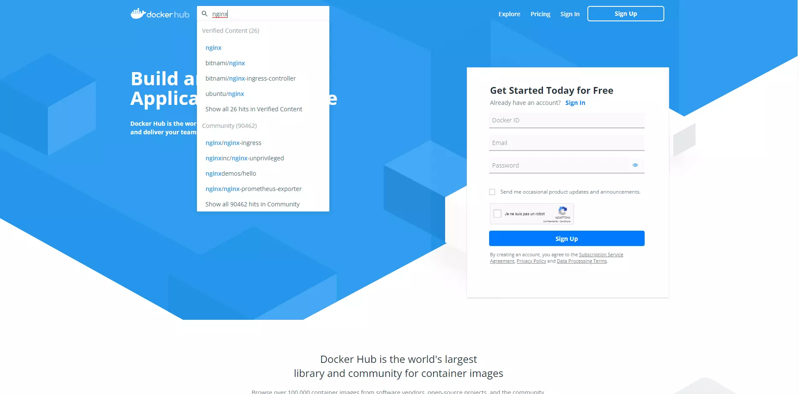
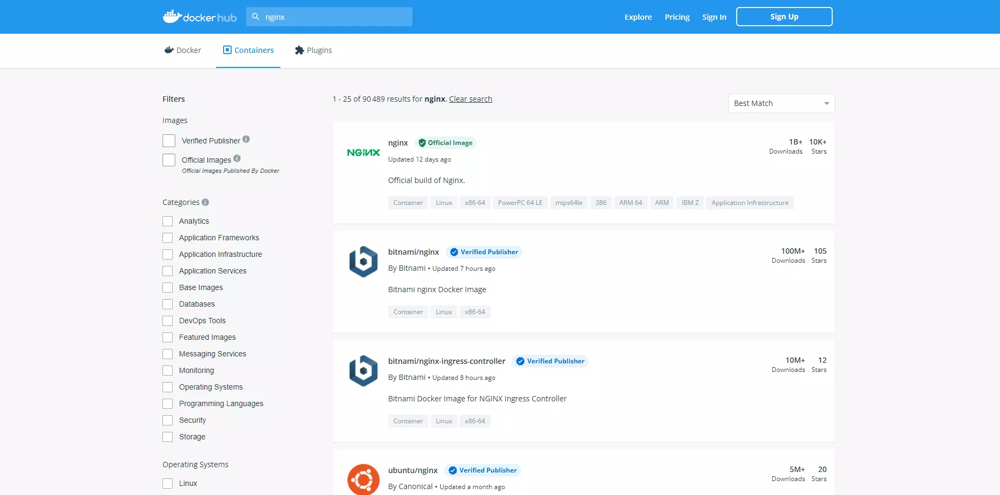
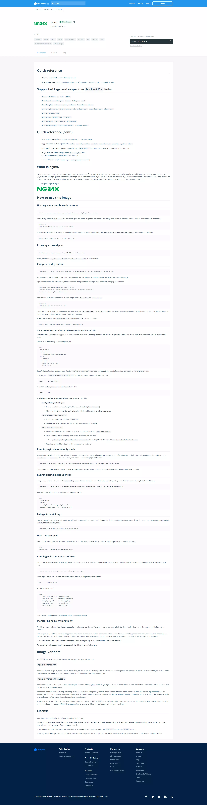

# :whale: Installation de Docker

==- :icon-unverified: Un problème avec sudo ?

---

!!!
Si vous configurez votre serveur directement en root. N'oubliez pas de retirer le `sudo` de chaque commande.
!!!

!!! danger
:arrows_counterclockwise: Si vous avez mis un mot de passe au compte root, la commande `sudo` ne sera pas acceptée.
Connectez-vous directement en root pour exécuter les commandes.  
:arrow_right: Vous pouvez aussi, réinstallez votre système en laissant le mot de passe root vide, lors de l'installation.  
`sudo` s'installera et fonctionnera correctement.
!!!

==-

---

## :card_index_dividers: Installation des dépendances

```
 sudo apt-get update && sudo apt-get install \
    apt-transport-https \
    ca-certificates \
    curl \
    gnupg \
    lsb-release
```

---

## :key: Ajouter la clé officielle GPG

```
curl -fsSL https://download.docker.com/linux/debian/gpg | sudo gpg --dearmor -o /usr/share/keyrings/docker-archive-keyring.gpg
```

---

## :books: Ajouter le repo stable

```
echo \
  "deb [arch=$(dpkg --print-architecture) signed-by=/usr/share/keyrings/docker-archive-keyring.gpg] https://download.docker.com/linux/debian \
  $(lsb_release -cs) stable" | sudo tee /etc/apt/sources.list.d/docker.list > /dev/null
```

---

## :whale2: Installer Docker Engine

```
sudo apt-get update && sudo apt-get install docker-ce docker-ce-cli containerd.io
```

`O` Pour valider les demandes d'interventions, pendant l'installation.


:icon-codescan-checkmark: Vérifions notre installation de docker

```
sudo docker run hello-world
```

``` sudo docker run hello-world
Hello from Docker!
This message shows that your installation appears to be working correctly.

To generate this message, Docker took the following steps:
 1. The Docker client contacted the Docker daemon.
 2. The Docker daemon pulled the "hello-world" image from the Docker Hub.
    (amd64)
 3. The Docker daemon created a new container from that image which runs the
    executable that produces the output you are currently reading.
 4. The Docker daemon streamed that output to the Docker client, which sent it
    to your terminal.

To try something more ambitious, you can run an Ubuntu container with:
 $ docker run -it ubuntu bash

Share images, automate workflows, and more with a free Docker ID:
 https://hub.docker.com/

For more examples and ideas, visit:
 https://docs.docker.com/get-started/

```

!!! success
Votre installation est réussie !
!!!

---

## :package: Créer un container apache

A titre d'exemple, nous allons créer un container apache

```
docker run -d --name docker-apache -v /var/www/:/usr/local/apache2/htdocs/ -p 3000:80 httpd
```

:icon-three-bars: Détaillons la commande ci-dessus:

`docker run` permet de lancer un container ou si inexistant, l'installer.  
`-d` permet de se détacher du container  
`--name` NOM_CONTAINER  
`-v` pour "Volume", chemin sur la machine:chemin du container  
`-p` Pour spécifier le port local:port_du_container (http://IP_MACHINE:3000)  
`httpd` le nom de l'image apache, ca pourrait être `nginx` dans le cas d'une installation nginx.   

:icon-check-circle: La commande run va appliquer toutes les options à l'installation du service.

---

## :card_file_box: Afficher les containers docker

```
docker ps
```

`docker ps` affiche les containers actifs.

```
docker -a
```

`docker ps -a` affiche tous les containers.

---

## :whale: Le Docker Hub

Le `Docker Hub` est comme le play store à android.  
Il nous permet de trouver les images d'installations de containers officielles ou non, ainsi que leur documentation.

  

  




