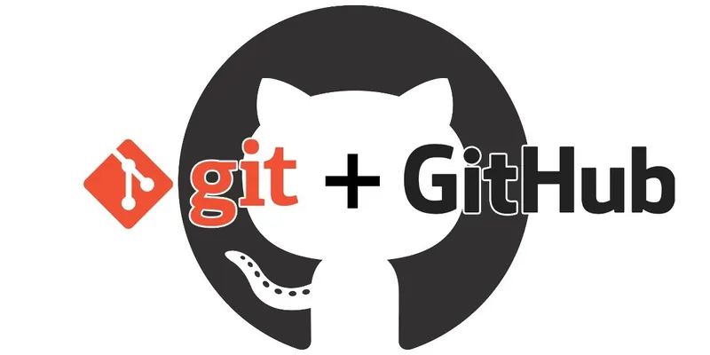
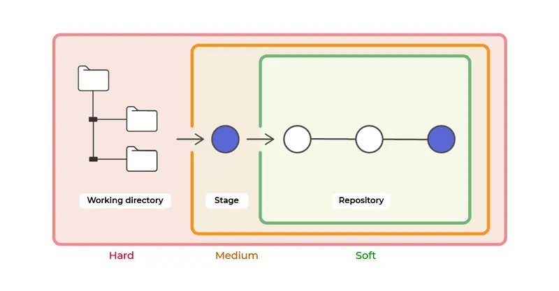
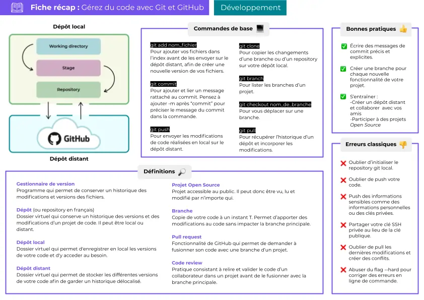

# 👽 GIT & Github



==- :icon-report: Mises en garde

!!! primary
Vous pouvez directement utiliser la barre de recherche.  
Ou l'onglet de droite pour trouver la section qui vous intéresse.
!!!

!!! danger
Toutes les adresses ip et masques de cette documentation, sont proposés à titre d'exemple, et peuvent donc, ne pas coïncider avec votre configuration.  
Faites attention, à bien renseigner les vôtres :slightly_smiling_face:
!!!

===

:icon-arrow-right: Cet outil a trois grandes fonctionnalités :

- Revenir à une version précédente de votre code en cas de problème.
- Suivre l’évolution de votre code étape par étape.
- Travailler à plusieurs sans risquer de supprimer les modifications des autres collaborateurs. 

!!!primary
Il existe plusieurs alternatives à Github, la plus connue est **Gitlab** qui est un **fork de github** qui vise ajoute des améliorations et offre la possibilité de l'**auto-héberger**. Le fonctionnement reste similaire.
!!!

---

## :icon-tasklist: Fonctionnement

:icon-chevron-right: Git fonctionne de manière similaire à la sauvegarde incrémentielle, un ensemble de dossiers/fichiers va être ajouté au projet.  
Par la suite, un historique complet des changements du projet sera disponible, ces changements pourront être ignorés, ajoutés, supprimés ou mergés (fusionnés).  

:icon-chevron-right: Git propose un système de branche, ce qui permet par exemple, de développer le contenu du projet de la branche principale sans altérer celle-ci.  Puisqu'au préalable Git aura fais une sorte de clone secondaire de la branche  
(avec la commande `git checkout -b mabranche`).

  


:icon-triangle-right: **Le Working directory** correspond au dossier du projet sur la machine.

:icon-triangle-right: **Le Stage ou Index** est l'étape intermédiaire qui représente tous les fichiers modifiés qui ont été **"indexés"**. [!ref icon="rocket" text="Comment indexer un dossier/fichier"](https://linux.contactit.fr/git_github/#ajouter-des-dossiersfichiers-au-dépot)

:icon-triangle-right: **Le repository** est l'ensemble du projet avec les commits réalisés.

---

## :icon-package-dependencies: Le dépôt local

:icon-triangle-right: Un dépôt est l'ensemble des dossiers/fichiers qui constituent un projet initié avec Git.  
:icon-triangle-right: Dans la documentation en ligne ou en milieu professionnel, on parle souvent de repository, qui est la traduction anglaise du terme “dépôt”.  
:icon-triangle-right: Le dépôt local est stocké directement sur la machine.

---

## :icon-package-dependents: Le dépôt distant

:icon-triangle-right: Le dépôt distant est hébergé sur un serveur distant :brain:

---

## :icon-download: Installation de Git

```js !#10 sudo apt install git
[sudo] Mot de passe de contact :
Lecture des listes de paquets... Fait
Construction de l'arbre des dépendances... Fait
Lecture des informations d'état... Fait
git est déjà la version la plus récente (1:2.34.1-1ubuntu1.4).
git passé en « installé manuellement ».
0 mis à jour, 0 nouvellement installés, 0 à enlever et 0 non mis à jour.
1 partiellement installés ou enlevés.
Après cette opération, 0 o d'espace disque supplémentaires seront utilisés.
Souhaitez-vous continuer ? [O/n]
```

:icon-triangle-right: Valider l'installation: `O` ou ajouter l'option `-y` a la fin de la commande.

---

## :icon-id-badge: L'identité

:icon-info: L'identité dans Git est simplement votre nom et votre adresse mail.  
 
:icon-list-unordered: Ces deux informations sont nécessaires aux validations Git:    

:icon-triangle-right: ``` git config --global user.name "John Doe" ```

:icon-triangle-right: ``` git config --global user.email contact@contactit.fr ```

!!!info
Grâce à l’option `--global` vous n’aurez besoin de le faire qu'une fois.
!!!

!!!warning
Si vous souhaitez, pour un projet spécifique, changer votre nom d’utilisateur, vous devrez repasser cette ligne mais sans le  
`--global`  
!!!

:icon-triangle-right: Pour vérifier que vos paramètres ont bien été pris en compte, il suffit de passer la commande:  
`git config --list`  

!!!success
Il est recommandé d'activer les couleurs, pour une meilleure visibilité:  
```js
git config --global color.diff auto
git config --global color.status auto
git config --global color.branch auto
```
!!!

---

## :icon-duplicate: Initier un dépot  

:icon-arrow-up: Aller au repertoire désiré, par exemple: `cd ~/monprojet`  

:icon-triangle-right: Initier un dépôt local:   

```js !#11 git init
astuce: Utilisation de 'master' comme nom de la branche initiale. Le nom de la branche
astuce: par défaut peut changer. Pour configurer le nom de la branche initiale
astuce: pour tous les nouveaux dépôts, et supprimer cet avertissement, lancez :
astuce:
astuce:         git config --global init.defaultBranch <nom>
astuce:
astuce: Les noms les plus utilisés à la place de 'master' sont 'main', 'trunk' et
astuce: 'development'. La branche nouvellement créée peut être rénommée avec :
astuce:
astuce:         git branch -m <nom>
Dépôt Git vide initialisé dans /home/contact/contactit.fr/.git/
```

:icon-triangle-right: Ou initier un dépôt distant:

```js git clone https://github.com/username/projet/monprojet.git
Clonage dans 'monprojet.git'...
remote: Enumerating objects: 11779, done.
remote: Counting objects: 100% (82/82), done.
remote: Compressing objects: 100% (66/66), done.
remote: Total 11779 (delta 52), reused 33 (delta 16), pack-reused 11697
Réception d'objets: 100% (11779/11779), 23.50 Mio | 11.34 Mio/s, fait.
Résolution des deltas: 100% (7047/7047), fait.
```

:icon-info: La commande `git clone` va directement **importer le projet** ainsi que les fichiers sources de celui-ci dans un dossier portant son nom.   

:icon-triangle-right: Il peut être nécessaire de mettre à jour le repository suite à un changement effectué par un autre acteur du projet, utilisez la commande:  

```js
git pull origin mabranche
```

!!!primary
**"Pull"** et **"fetsh"** permettent de requêter un repository
!!!

---

### :icon-check: **Vérification**  

```js !#4 ls -la
total 12
drwxr-xr-x  3 contact contact 4096 sept.  5 15:26 .
drwxr-x--- 14 contact contact 4096 sept.  5 15:23 ..
drwxrwxr-x  7 contact contact 4096 sept.  5 15:26 .git
```

:icon-check-circle: Le dépot `.git` est bien pésent dans le répertoire sous la forme d'un dossier caché.

---

## :icon-file-added: Indexer des dossiers/fichiers au dépot:  

:icon-file-added: La commande `git add` permet d'indexer des fichiers à Git.  
:icon-triangle-right: Une fois les dossiers/fichiers indexés, il est possible de faire un commit après modification d'un élément.

:icon-list-unordered: Quelques exemples:  

:icon-triangle-right: `git add README` ajoute le fichier `README`  
:icon-triangle-right: `git add .` ajoute l'ensemble des dossiers et fichiers à l'endroit ou le `.git` se trouve.  

---

## :icon-diff-ignored: .gitignore

:icon-triangle-right: `.gitignore` est un fichier qui **recense les dossiers/fichiers ignorés par GIT.**  
- Il répond à une syntaxe définie.  

:icon-list-unordered: Quelques exemples:  

:icon-triangle-right: `*.log` ignore tous les fichiers ayant l'extension `.log`  
:icon-triangle-right: `/dossier` ignore le dossier de manière récursive.  

:icon-unverified: Plus d'informations sont disponibles [ici](https://www.atlassian.com/fr/git/tutorials/saving-changes/gitignore#:~:text=gitignore%20doit%20%C3%AAtre%20%C3%A9dit%C3%A9%20et,doivent%20ou%20non%20%C3%AAtre%20ignor%C3%A9s)

!!!primary
`git status` permet de voir **les changements** des dossiers/fichiers par rapport à la dernière version enregistrée (**commit**).
!!!

---

## :icon-git-commit: Les commits

Un "**commit**" est **une version des dossiers/fichiers indexés précedemment**, qui est différente par rapport à la version ultérieure.

- la commande `git commit` permet de valider les changement opérés sur les fichiers indexés ou "stagés" par GIT.  

!!!primary
Ces changements sont appliqués du "working directory" et ne sont donc plus en "Stage", ils sont déplacés dans le "repository".
!!!

!!!success
Il est conseillé de nommer les commits avec un nom différent pour chaque étape de modification.  
`git commit -m etape1` permet de nommer (indiquer de manière conçise le contenu du commit, limite max. 60 caractères).  
`git commit --amend -m "etape2"` permet de changer le nom du commit existant !
!!!  

- Il est possible de voir les commits précédemment enregistrés avec la commande:  

```js
git log
```

- Cette commande permet également de consulter le contenu d'un ou plusieurs commits:  

```js
git log -p1
```

L'option `-p1` affiche le dernier commit réalisé.

---

## :icon-package-dependents: Push le repository

- Il faut d'abord ajouter l'origine (l'endroit ou est le repository distant):  

```
git remote add origin https://github.com/username/projet/monprojet.git
```

!!!primary Astuce:
`git remote add nom https://github.com/username/projet/monprojet.git` permet de **raccourcir** le nom (**url > "nom"**) pour appeler le dépôt par la suite.
!!!

- Sélectionner la branche  dans laquelle je veux uploader le repository:  

```
git branch -M mabranche
```

- Envoyer le repository:  

```
git push -u origin mabranche
```

---

## :icon-git-branch: Les branches

:icon-triangle-right: Une branche est une copie du projet à un instant `T`, toutes les modifications faites sur celle-ci n'affectera que cette dernière.  
Cela permet d'avoir **plusieurs états du projet simultanément.**  

:icon-triangle-right: La branche principale est la branche `main` (précédemment appelée `master` avant octobre 2020). Cette branche est souvent la branche de **production** donc stable, du projet.  

:icon-triangle-right: Il peut y avoir d'autres noms de branches comme: `dev` ou `stagging` ce sont des branches non stables en développement actif, des tests et vérifications seront faites sur celles-ci une fois le développement terminé.  

:icon-triangle-right: Si le réultat est concluant alors il est possible que ces branches soient `mergées` (fusionnées) à la branche `main` ou `master`.
Les branches sont souvent utilisées pour recréer un environnement de **tests** / **préproduction et production.**  


:icon-quote: Git peut être comparé à un arbre:  

:icon-triangle-right: Le tronc de l'arbre est la branche principale du projet (la plupart du temps: **main** ou **master**)

:icon-triangle-right: Les branches sont des éléments qui viennent du tronc mais qui partent dans des diréctions différentes

:icon-triangle-right: Les feuilles sont les unes sur les autres, plus ou moins nombreuses et tombent ou reste sur les branches comme les **commits**.  

:icon-chevron-right: conclusion: en hiver on a plus de commits 😉  

---

:icon-chevron-right: La commande `git branch` permet de lister les branches du repo:  

```js !#2 git branch
  list
* master
```

:icon-triangle-right: Ici il y a deux branches: **list** et **master**.  
Le `*` indique que je suis actuellement dans la branche master.

!!!primary
L'option `-d` supprime une branche (`git branch -d mabranche`)
!!!

!!!primary
L'option `-b` créer une nouvelle branche (`git checkout -b mabranche`)
!!!

:icon-triangle-right: La commande `git checkout mabranche` permet de changer de branche:

```js git checkout mabranche
Switched to branch 'mabranche'
```

:icon-triangle-right: Il est possible de créer une branche à partir d'un commit, avec l'une des commandes:

```js 
git checkout -b manouvellebranche <commit_sha>
```

!!!primary
A noter que `git checkout <sha>` permet également de revenir sur un commit.
!!!

:icon-triangle-right: Pour avoir le `sha` (hash) du commit nous pouvons passer la commande:  

```js !#3 git log --oneline --graph
* 5aaf865 Suppression du README
* 6746dbc Ajout d'un texte de test
* 931dc0f Création du README
```

:icon-arrow-right: le `sha` est constitué de la suite de caractères héxadécimaux après le **"*"** :icon-arrow-right: **931dc0f**, par éxemple.  

:icon-arrow-right: Ici je créer une branche à partir du commit **931dc0f** dont la modification porte sur la création du README.

---

## :icon-git-branch: Fusionner (merge) deux branches  

:icon-triangle-right: Il faut d'abord se positionner dans la branche de destination du merge:  

```js git checkout master
Switched to branch 'master'
```

:icon-triangle-right: Puis fusionner les commits des branches:  

```js git merge mabranche
Merge made by the 'recursive' strategy
```

---

## :icon-share-android: Git stash

:icon-chevron-right: La commande `git stash` permet de mettre un commit de côté pour que la branche actuelle redevienne propre, donc sans données dans la zone de stage. Cette situation convient dès lors qu'un commit n'a pas été réalisé et que les modifications sont toujours dans le stage.

:icon-chevron-right: Dans les faits, la commande `git status` nous retournent qu'il y a plusieurs changements(dans la zone de stage), qui n'ont pas été commités.

:icon-chevron-right: Stash nous permet de les mettres de côté, pour pouvoir les insérer dans une autre branche, ce qui peut être pratique lorsque je me suis trompé de branche en faisant mes modifications !

:icon-chevron-right: Après avoir éxécuté la commande `git stash` si je refais la commande `git status` cette dernière nous retourne que le working directory est propre (stage vide).

:icon-chevron-right: Maintenant je peux aller dans une vouvelle branche ou une existante avant d'y insérer les changements éffectués:

```
git branch manouvellebranche
```

```
git checkout manouvellebranche
```

```js git branch
* manouvellebranche
master
```

```js
git stash apply
```

:icon-chevron-right: Il est possible d'avoir plusieurs stashs. Dans ce cas, la commande `git stash list` permet de les lister avec leurs noms réspectifs.

:icon-chevron-right: Ainsi je peux appliquer un stash avec son nom: `git stash apply stash@{0}`  
(le nom commençant par stash... et finissant juste avant le `:`)

---

## :icon-repo-deleted: Git reset

:icon-chevron-right: **Git reset** permet d'annuler des changements de trois façons différentes: `soft`, `mixed` et `hard`



---

### :icon-issue-reopened: Supprimer le dernier commit

:icon-chevron-right: Je commence par regarder les logs et donc le dernier commit réalisé ainsi que son identifiant:  

```js !#1 git log commit
ca83a6dff817ec66f443420071545390a954664949 Author: contact 
<contact@contactit.fr> Date: Mon Mar 19 21:52:11 2022 -0700
```

:icon-chevron-right: Je prends note de l'identifiant: `ca83a6dff817ec66f443420071545390a954664949` si j'ai besoin de l'affecter à une autre branche après l'avoir supprimé.

:icon-chevron-right: Maintenant je peux supprimer le dernier commit avec la commande:

```
git reset --hard HEAD^
```

==- :icon-git-pull-request-closed: Après l'avoir supprimé je peux aussi l'appliquer à une autre branche.

:icon-dash: Créer ou se positionner dans la branche:  

```
git branch manouvellebranche
```

```
git checkout manouvellebranche
```

```
git reset --hard ca83a6dff817ec66f443420071545390a954664949
```

==-

---

### :icon-id-badge: L'identification sur Github

:icon-shield-lock: Github repose sur l'identification avec SSH, donc une paire de clés.

:icon-key: Pour génrer cette paire de clé, j'utilises la commande suivante:  

``` ssh-keygen -t ed25519
Generating public/private ed25519 key pair.
Enter file in which to save the key (/home/contact/.ssh/id_ed25519):
Created directory '/home/contact/.ssh'.
Enter passphrase (empty for no passphrase):
Enter same passphrase again:
Your identification has been saved in /home/contact/.ssh/id_ed25519
Your public key has been saved in /home/contact/.ssh/id_ed25519.pub
The key fingerprint is:
SHA256:monhash contact@mondomain
The key's randomart image is:
+--[ED25519 256]--+
|%@+.             |
|EBCVB.             |
|+=Bo.            |
|+.o* .           |
|oo..o . S S       |
|=+oo   o         |
|B++ o . .        |
|+=.. o .         |
|o.    . .         |
+----[SHA256]-----+
```

!!!success
`ed25519` est le **standard actuel recommandé en terme de sécurité**, **RSA** est compatible avec plus de systèmes (mais **moins sécurisé** (-4096 minimum)).
!!!

:icon-reply: Ensuite, je récupère la **clé publique** qui servira à **prouver mon identité à github**:  

``` cat ~/.ssh/id_ed25519.pub
ssh-ed25519 AAAAC3NzaC1lZDI1NTE5AAAAKC91uWop9DhfNh23i6u0yUlhEkGv0IOQKzhU5ltKBkAG contact@contactit.fr
```

:icon-iterations: Je peux maintenant la renseigner dans: `Settings>SSH and GPG keys`, dans la séction **titre** je peux mettre un nom quelconque et dans la section **key** je colle `ssh-ed25519 AAAAC3NzaC1lZDI1NTE5AAAAKC91uWop9DhfNh23i6u0yUlhEkGv0IOQKzhU5ltKBkAG contact@contactit.fr`, **valider** avec `Add SSH key`.

---

## :icon-list-unordered: Résumé de Git/github

[](images/summary.webp)

---
Dernière modification le 08/09/2022