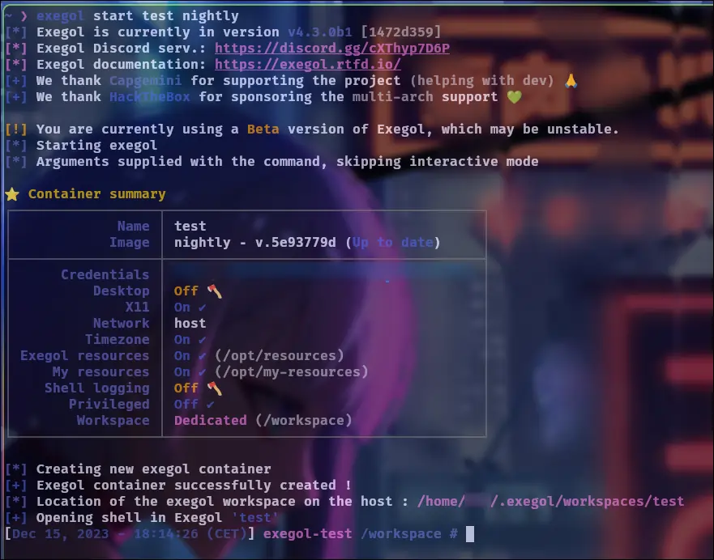

# 💻 My workstation configuration

---

# 🔬 Which model you choosed ?

Before naming the model, I would like to say first that I set some limits regarding the budget and the performance of the machine. I need laptop for the **school and events** and I want it to be as **powerful as possible** (I tought about an i7 or Ryzen 7 and 16GB, seems good for few virtual machines and pentesting) for a budget around **$600** (550€). So, I looked for a **second hand computer** on famous marketplaces in order to get a good bang for the buck. Ideally I would like a **fingerprint sensor**, a **"cache camera"** included and a **lightweight** one (for moving).

As an IT worker for few years now, I noticed that a lot of enterprises (including the ones I was in) **switched from various brands to Lenovo Thinkpads** for good reasons as look, feel, performance/price, keyboard, functionalities and most of all stability and good support. I had many Thinkpads in hands and feel great. I will take one personnally.

The context is said, after few weeks of search I found one feets my needs in a perfect condition for $550. The storage was about **500GB**, so I commanded a new nvme of **1TB** at the same time for $100.

Here is the precise model i have now : **Lenovo ThinkPad P14s Gen 1 - 14"**

+++ Front

+++ Behind

+++

CPU | RAM | ROM
--- | --- | ---
Ryzen 7 PRO 4750U (8 physicals cores) | 16GB 3200Mhz | 1TB Nvme Samsung EVO 775 Pro

All specifications could be found [here](https://www.officexpress.fr/10145925-20y1000qfr-lenovo-thinkpad-p14s-gen-20y1-amd-ryzen-pro-4750u-jusqu-ghz-win-pro-bits-radeon-graphics-ram-256-ssd-tcg-opal-encryption-ips-1920-1080-full-noir-clavier-fran-ais-3540260184357).

**PS** : I thinked about thinkpad with **IntelME** __partially__ disabled and **libreboot** 🕵️, but minifree.org don't provide recent machines, I was interested by the T440p they have (literaly a brick) and there is a significant gap betwteen the i7 4th gen in and the Ryzen 7 4th gen of the P14S Gen1.

---

### ⚙️ What Operation System do you use ?

-

**So yeah, I use Arch btw.........** 😎

If you want to take care about packages, configurations and scripts yourself Arch is the way to go to keep control and mostly **LEARN** by doing and understand the way packages and GNU/Linux works. Since the OS is really minimal per default so **"DO IT YOURSELF"**.

ArchLinux is a **"Rolling release"** distribution means that packages are upgraded on latest version when available, so there are no "releases". There is the "Arch Wiki" as well, who you can compare to the "Holy bible" of arch users (and yeah, it's pretty HUGE). The **"Arch user"** is **THE** smart guy (That what the users said not me 😀, lots of humor).

The **"Arch Users Repository"** is a huge repository of packages provided by the community, it aims at complete the officials ones and permit to all developers to share their packages. Keep in mind that theses packages are unofficial.

---

### 📟 What about your desktop environment ?

-

I love simple, modern and smart things. I discovered **Hyprland** few years ago and decided to give it a try on this laptop, so I searched at tutorials on youtube to see how peoples managed to install, customize it and the results. I land on the **Ja Kool.it**'s [youtube channel](https://www.youtube.com/@Ja.KooLit) and followed the "My Hyprland Dots v2 on Debian 13 Linux minimal using netinstaller and Debian-Hyprland install script" [video](https://www.youtube.com/watch?v=Qc4VP9JFh2Y). This config **blew my mind**, it worked out of the box, it was fast, responsive and eyes candy!

But wait, you said you're on Arch right now ! So yes, I switched few weeks later because of the **unsustainability of the SID realease of debian**, the fact that some **core packages aren't maintained** and Ja would like to **stop the support about his configurations on debian Trixie** for the moment.

---

### 🛠️ What about pentesting tools ?

When you want a **pentesting environment**, you will think first about a GNU/Linux "Hacking" distribution like : Kali, Parrot, BlackArch or AthenaOS. The huge downside of theses distributions is you **don't have the the control about the installed packages, the python projects implementation** (are they installed properly in venv, with symlinks for convenience ?), **the bloatwares** (packages installed by default that you will never use and yeah, there are a lots !), oh, and yes again **python dependancies that can get conflicts with the time**. To conclude, separate the operation system from the tools used is the way to go.  

Its here that **exegol** enter. For thoses who aren't familiar with exegol, it's a French FOSS project made by Shutdown, Dramelac with the support of capgemini (A big tech company) and Hack The Box mainly. The goal is to **keep the OS clean by managing containers with a docker backend**. A python wrapper take care of all the "docker things" for you. So, in a container you have : **all tools you need**, you can attach a **vpn** to it (--vpn config.ovpn), open a browser and apps with a GUI, attach **usb devices**, **remote desktop into the container environment** (in beta, with --desktop) and more (For all features look at [The Exegol Docs](https://exegol.readthedocs.io/en/latest/)).

The whole thing made easy as starting a container :

```sh
exegol start test nightly
```



Where `test` is the container's name and `nightly` the docker image it's based on. You can download exegol images easily with :

```sh
exegol install
```

It will ask your for the name of the image you want to install as the table shows.


---

#### 🔧 TIPS

As mentionned earlier, we can open browser windows in our containers. Since I use Firefox mainly and there is Firefox as the default brower in containers, sometimes "in the action" I use the wrong browser window to download a thing on my host and instead it goes into the container. Because I use Hyprland, the titles of the windows don't appear anymore. To solve that i didn't bring back the titles, but i configure exegol to **install a firefox theme in every container**. That way the two windows are easily distinguishable as shown with the picture below.


I added as well, **uBlock Origin** to all containers to block annonyances (cookies prompts, ads, trackers...) by editing the following file :

```sh vim ~/.exegol/my-resources/setup/firefox/addons.txt
# This file can be used to install addons on the Firefox instance of Exegol.
# The download links of the addons to be installed can be listed in this file (ie: https://addons.mozilla.org/fr/firefox/addon/foxyproxy-standard/).
# All addons listed below will be downloaded and installed automatically when creating a new Exegol container.
https://addons.mozilla.org/fr/firefox/addon/ublock-origin/
https://addons.mozilla.org/fr/firefox/addon/rainbow-sparkle-animated-theme/
```

I added a line in the `~/.zsh_history` for opening burpsuite and assign it a PID to let my shell usable (same as firefox command but for burpsuite) :

```sh vim ~/.exegol/my-resources/setup/zsh/history
burpsuite &> /dev/null &
```

---

### 🗄️ And for Virtualization ?

I use **KVM/QEMU** and **VMWare Workstation** (because its used a lot by students and permit the export of virtual machines in the ova format properly). 

---

### 🗃️ How do you manage programs ?

**Pacman** take care of core packages, **yay** of **AUR**'s ones and I try to use as much as possible **AppImages**. To help me manage shortcuts (access in menus) and updates (like a packets manager), I use [**AM-Application-Manager**](https://github.com/ivan-hc/AM-Application-Manager). The AppImage format provides a good way to use apps whitout actually installing it, quick to install, remove and **keep the OS clean without writing in system files.**

---