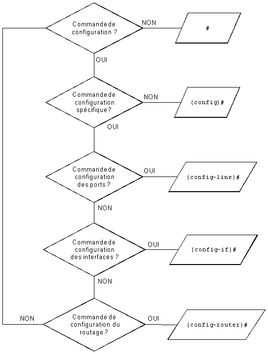

# :shield: La Hiérarchie du CLI Cisco



**Le "Command Line Interface" de CISCO est composé de plusieurs modes:** 

## :small_blue_diamond: Le mode "utilisateur"

Permet seulement d'effectuer quelques commandes basiques.

```
Switch>
```

## :small_blue_diamond: Le mode "Privilégié"

Permet plus de remonté d'informations.  
Comme les commandes `show` notamment.

```
Switch#
```

## :small_blue_diamond: Le mode "Configuration Globale"

- Contient également plusieurs sous-modes (détaillés [ici](#configuration-d-une-interface)).

```
Switch(config)
```

  

---

### :hammer_and_wrench: Configuration d'une interface

``` Router(config)#
interface GigabitEthernet0/0
```

:information_source: GigabitEthernet0/0 est ici, le nom de l'interface (physique ou logique), dans laquelle nous rentrons.  
Si vous ne connaissez pas le nom de votre interface, utilisez la commande `show interfaces` **en mode enable**.
Vous pouvez utiliser la commande `interface ?` pour voir l'ensemble des actions possibles.

:point_right: `Router(config-if)#` s'affiche après exécution de la commande. 

``` Router(config-if)#
ip address 192.168.1.1 255.255.255.0
```

Permet d'adresser l'interface.

!!! Warning
**Ne pas oublier `no shutdown` pour démarrer l'interface.**
!!!

---

### :hammer_and_wrench: Configuration de plusieurs interfaces

``` Router(config)#
interface range GigabitEthernet0/0-2
```

``` Router(config-if)#
no shut
```

Démarre les interfaces GigabitEthernet0/0, GigabitEthernet0/1 et GigabitEthernet0/2.

---

### :hammer_and_wrench: Configuration d'une ligne

``` Router(config)#
line vty 0 1
```

:point_right: `Router(config-line)#` s'affiche après exécution de la commande.  

:information_source: Les "lignes" permettent un accès distant à l'équipement.  
En passant par du telnet (en clair) ou du SSH (chiffré).
Vous pouvez utiliser la commande `line ?` pour voir l'ensemble des actions possibles.

[!ref icon="terminal" text="Voir les accès distants"](acces-distants.md)  

---

### :hammer_and_wrench: Configuration du routeur

``` Router(config-router)#
router ospf
```

:information_source: `router` permet de configurer le routeur pour faire ici, de l'OSPF.  
Les options possibles, sont des protocoles de routage entre routeurs.  
Vous pouvez utiliser la commande `router ?` pour voir l'ensemble des protocoles disponibles.

:point_right: `Router(config-router)#` s'affiche après éxécution de la commande.

---

:icon-diff-renamed: Dernière modification: 14/09/2022 - 12h00
