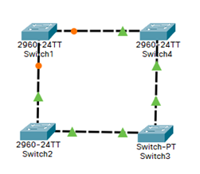
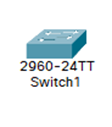
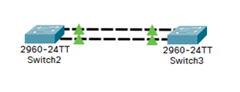

# :electric_plug: LAYER 2: Vlan, Spanning-tree, Trunk, ÉtherChannel et Encapsulation dot1Q

!!! Warning Cette documentation est en cours d'écriture :writing_hand:
Il pourrait il y a avoir quelques erreures.  
Si vous en remarquez une, contactez-moi [ici](mailto:contactit.yarka@slmail.me) :slightly_smiling_face:
!!!

!!! primary
Vous pouvez dirèctement utiliser la barre de recherche.  
Ou l'onglet de droite pour trouver la section qui vous intéresse.
!!!

---

## :moyai: Les vlans

Le vlans permettent de découper un switch en plusieurs parties.
- Meilleure sécurité, Gestion, moins de coût.
- Limitation du domaine de broadcast > plus de performances.

:point_right: Il existe deux moyens pour créer un vlan:

``` Switch(config)#
vlan 10
```

:point_right: Créer le vlan 10

``` Switch(config)
int f0/1
```
``` Switch(config-if)#
switchport access vlan 10
% Access VLAN does not exist. Creating vlan 10
```

:point_right: L'interface `f0/1` à maintenant accès au vlan 10.

Le préfixe `no` permet de supprimer un vlan:

``` Switch(config)
no vlan 10
```

---

## :abacus: Le spanning-tree

Le spanning-tree évite les boucles de broadcast et attribue un prix de chemin et une priorité pour chaque vlan.  
Il organise une élection en fonction des **BIDs** (identifiant du bridge) et adresses MAC respectifs de chaque équipement.  

!!! primary
Plus la valeur et faible et plus le switch à des chances d’être élu « root bridge ».  
!!!

!!! success
Le root bridge est obligatoirement traversé pour sortir du réseau local.
!!!

Il est possible de définir la priorité d'un vlan:

```
Switch(config)#spanning-tree vlan 10 priority 8000
% Bridge Priority must be in increments of 4096.
% Allowed values are:
0 4096 8192 12288 16384 20480 24576 28672
32768 36864 40960 45056 49152 53248 57344 61440
```

!!! primary
Le BID doit obligatoirement être une des valeurs listées ci-dessus. (binaire ^2)
!!!

- Il est possible de forcer le « root bridge » à un vlan, indépendamment du BID:

``` Switch(config)#
spanning-tree vlan 10 root primary
```

- Si le root bridge tombe, le suppléent peux prendre le relais:

```Switch(config)#
spanning-tree vlan 10 root secondary
```

---

## :rolled_up_newspaper: Le trunk

Le trunk va faire transiter un ou plusieurs vlan.s entre plusieurs équipements.  
C'est comme s'il ajoutait plus de ports au 1er switch.

||| Vue physique

||| Vue logique

|||

Pour configurer un lien trunk, il est nécessaire de configurer l'interface (le port),  
avec les commandes:

``` Switch(config)#
int f0/1
```

``` Switch(config-if)#
switchport mode trunk
```

!!!
Si les équipements configurés sont récents, l'équipement de l'autre côté du lien trunk pourra détecter ce lien, et donc renseigner sa configuration automatiquement.
!!!

---

## :zap: L’ÉtherChannel

L’ÉtherChannel permet l’agrégation de liens (8 liens maximum).  
Permet d’augmenter le débit de la bande passante et de faire de la redondance/tolérance de pannes.



- Sélectionner la plage d'interfaces :

``` Switch(config)#
int range f0/1-2
```

- Création du lien ÉtherChannel n°1 sur les interfaces :

``` Switch(config-if-range)#
channel-group 1 mode on
```

Ici le « mode on » indique que nous sommes en mode manuel.  
Il faut refaire les commandes ci-dessus sur le 2ème switch.  

!!! success
**Les deux liens physiques sont vus comme étant un lien logique: EtherChannel n°1.**
!!!

---

## :incoming_envelope: L'encapsulation DOT1Q

L’encapsulation permet avec un seul lien physique, le routage de plusieurs vlans.  
Le routeur va **taguer les trames** pour identifier les vlans.   
Pour cela, il est nécessaire de créer des « sous-interfaces ».  

``` Routeur(config)#
int g0/0/0.10
```

- Encapsulation des trames du vlan 10, selon le standard **IEEE 802.1Q.**

``` Routeur(config-subif)#
encapsulation dot1Q 10
```

- Définition de l’adresse IP de la patte LAN du vlan spécifié.

``` Routeur(config-subif)#
ip address 192.168.10.1 255.255.255.0
```

- 192.168.10.1 est la passerelle des équipements du vlan 10.  

!!! Warning
**Ne pas oublier d’allumer l’interface physique : g0/0/0**
!!!

!!!
Si vous avez plusieurs vlans à configurer, c'est les mêmes commandes.  
Il faut juste les adapter pour votre configuration.   
!!!

Prennons l'exemple de la configuration de l'encapsulation dot1Q du vlan 20:

``` Routeur(config)#
int g0/0/0.20
```

``` Routeur(config-subif)#
encapsulation dot1Q 20
```

``` Routeur(config-subif)#
ip address 192.168.20.1 255.255.255.0
```

!!! Warning
**Ne pas oublier d’allumer l’interface physique : g0/0/0**
!!!

---

### :bookmark_tabs: Résumé des commandes DOT1Q

Copier/coller directement ces lignes (en adaptant votre configuration), dans votre terminal:

```
conf t
int g0/0/0.10
encapsulation dot1Q 10
ip address 192.168.10.1 255.255.255.0
no shut
```

---

:icon-diff-renamed: Dernière modification: 14/09/2022 - 12h00


