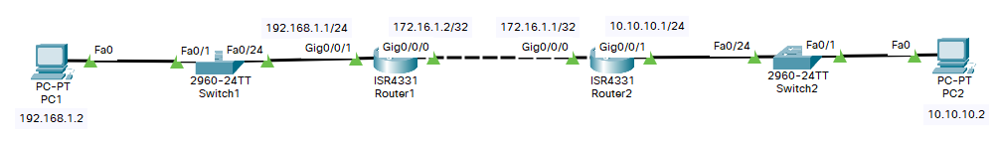
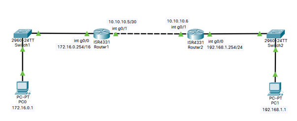

# :satellite_antenna: LAYER 3: Routage statique, RIPv2 , OSPF, NAT

---

## 🔄 L'interface de LOOPBACK

:icon-arrow-right: L'interface de loopback est virtuelle et permet une solution de secours de connexion ssh et prends effet sur l'ensemble des ports de l'équipement réseau.  

:icon-arrow-right: Elle permet également d'identifier le prochain routeur en multi-zone sur le protocole de routage OSPF.  

:icon-arrow-right: L'intérêt est dans le cas d'un réseau interconnecté, de toujours avoir un chemin de secours pour atteindre l'équipement souhaité.  

:icon-arrow-right: Cette interface agit comme un vlan donc un réseau différent des autres réseaux connus du routeur.    

:icon-arrow-right: Je commence par créer l'interface sur les équipements:  

``` Router1(config)#
interface loopback 0
```

``` Router2(config)#
interface loopback 0
```

:icon-report: Une annonce nous dit que l'interface de loopback est maintenant **UP**.  

```
%LINK-5-CHANGED: Interface Loopback0, changed state to up

%LINEPROTO-5-UPDOWN: Line protocol on Interface Loopback0, changed state to up
```

:icon-diff-renamed: Il faut maintenant adresser l'interface avec son masque et refaire le même processus pour le routeur d'en face.  

``` Router1(config-if)#
ip address 1.1.1.1
```

``` Router2(config-if)#
ip address 2.2.2.2
```

:icon-diff-renamed: Comme c'est un réseau différent il faut configurer du routage sur les équipements, statique par exemple. 

``` Router1(config)#
ip route 2.2.2.0 255.255.255.0 192.168.1.2
```

``` Router2(config)#
ip route 1.1.1.0 255.255.255.0 192.168.1.1
```

:icon-diff-renamed: Maintenant je peux tester le routage avec un ping:  

``` Router1#
ping 2.2.2.2
```

---

## :black_circle: Le routage statique



:point_right: Pour pouvoir communiquer avec un autre réseau que le mien, c'est-à-dire avec un plan d'adressage différent; il faut établire un chemin entre les routeurs:

```
Router(config)#ip route 10.10.10.0 255.255.255.0 172.16.1.1
```

||| Réseau de destination avec son masque.
`192.168.1.0 255.255.255.0`
||| Next-hop (prochain nœud)
`172.16.1.1`
|||

!!!
`Next-hop` Par quel chemin je passe pour acheminer le paquet. 
!!!

:point_right: Configurer la route statique du 2ème routeur dans le sens inverse.

```
Router(config)#ip route 192.168.1.0 255.255.255.0 172.16.1.2
```

:point_right: Pour atteindre le réseau `192.168.1.0 255.255.255.0` je passe par `172.16.1.2`

La commande `Router#show ip route` permet d'afficher les routes connues du routeur.
Cette commande montre tous les protocoles de routages actifs avec les réseaux partagés.

```
Router#show ip route
Codes: L - local, C - connected, S - static, R - RIP, M - mobile, B - BGP
       D - EIGRP, EX - EIGRP external, O - OSPF, IA - OSPF inter area
       N1 - OSPF NSSA external type 1, N2 - OSPF NSSA external type 2
       E1 - OSPF external type 1, E2 - OSPF external type 2, E - EGP
       i - IS-IS, L1 - IS-IS level-1, L2 - IS-IS level-2, ia - IS-IS inter area
       * - candidate default, U - per-user static route, o - ODR
       P - periodic downloaded static route

Gateway of last resort is not set

     10.0.0.0/24 is subnetted, 1 subnets
S       10.10.10.0/24 [1/0] via 172.16.1.1
     172.16.0.0/16 is variably subnetted, 2 subnets, 2 masks
C       172.16.1.0/30 is directly connected, GigabitEthernet0/0/0
L       172.16.1.2/32 is directly connected, GigabitEthernet0/0/0
     192.168.1.0/24 is variably subnetted, 2 subnets, 2 masks
C       192.168.1.0/24 is directly connected, GigabitEthernet0/0/1
L       192.168.1.1/32 is directly connected, GigabitEthernet0/0/1
```

```
S       10.10.10.0/24 [1/0] via 172.16.1.1
```

!!!
`S` pour statique.
!!!

!!! dark
Il existe aussi une **route statique par défaut**  
`0.0.0.0 0.0.0.0 IP_NEXT_HOPE`  
Tous les réseaux que je ne connais pas, je le donne au `Next-Hope`
!!!

## ⚡ Le routage dynamique

---

### :fleur_de_lis: RIPv2

RIPv2 est un exemple de protocole de routage dynamique à **vecteur de distance.**  

:arrows_counterclockwise: Il permet à plusieurs routeurs de communiquer entre eux et, d'**annoncer les réseaux** qu'ils connaissent.  

:arrows_counterclockwise: Les routeurs mettent à jour leurs tables de routage (toutes les 30 secondes), en fonction des requêtes RIP qu’ils reçoivent.  

!!! secondary Le coût d'une route
RIPv2 prend en compte une notion de **coût**.  
"Combien de saut je vais faire pour atteindre ma cible".  

:arrow_right: C'est cette question que le routeur se pose.  
!!!

!!! success
Il prendra la route avec le coût le plus faible.
!!!

!!!
Quand on parle de **coût**, ce même principe, s'applique aux autres protocoles de routage.
!!!

!!! success Bonne pratique
Mettre les interfaces qui ne pointent pas vers un routeur, en mode passif.  
**Ce qui limite le Trafic RIP v2 uniquement aux réseaux entre routeurs (allège le réseau et limite la surface d’attaque).**
!!!



- Configurer le router 1 en mode RIP:

```
R1(config)#router rip
```

- Passer en version 2 :

```
R1(config)#version 2
```

- Spécifier les réseaux dans lesquels le routeur à une interface :

```
R1(config-router)#network 10.10.10.0
R1(config-router)#network 172.16.0.0
```

L’interface g0/0/0 du routeur 1 ne pointe pas vers un routeur.  
- Passer l’interface g0/0/0 en mode passif :

```
R1(config-router)#passive-interface g0/0/0
```

!!! secondary
C'est le même procédé pour le routeur 2 (pensez à adapter les réseaux que le routeur annonce).
!!!

---

#### :bookmark_tabs: Résumé des commandes RIPv2

Copier/coller directement ces lignes (en adaptant votre configuration), dans votre terminal:

```
conf t
router rip
version 2
network 10.10.10.0
network 172.16.1.0
passive-interface g0/0/0
```

---

### :beginner: L'OSPF

L’OSPF est un éxemple de protocole de routage à **état de liens**.   

Le protocole utilise des "zones" (ensemble de routeurs), pour sa configuration.

!!!
Le protocole de routage **BGP** permet de récuperer les tables de routages de l'ensemble des protocoles de routage dynamique. Il est utilisé par les fournisseurs d'accès internet.
!!!

!!!
Tous les routeurs à l’intérieur d’une zone doivent avoir le même ID de zone pour devenir des voisins OSPF.
!!!

Quatre éléments sont à retenir dans une configuration minimale d’OSPF:

- OSPF Process ID

``` Router(config)#
router ospf 1
```

- Router ID

``` Router(config-router)#
router-id 1.1.1.1
```

- Les interfaces passives

``` Router(config-router)#
passive-interface g0/0/0
```

- Les réseaux et l’aire à laquelle ils appartiennent ( 1 réseau par patte du routeur, sous-interfaces comprises ).

!!!warning
Il est important d'annoncer les réseaux avec l'adresse réseau de ces derniers et le wildard mask (masque inversé). 
!!!

==- :icon-quote: voir la liste des convertions
CIDR | Masque | Wildcard mask
--- | --- | ---
/32 | 255.255.255.255 | 0.0.0.0
/31 | 255.255.255.254 | 0.0.0.1
/30 | 255.255.255.252 | 0.0.0.3
/29 | 255.255.255.248 | 0.0.0.7
/28 | 255.255.255.240 | 0.0.0.15
/27 | 255.255.255.224 | 0.0.0.31
/26 | 255.255.255.192 | 0.0.0.63
/25 | 255.255.255.128 | 0.0.0.127
/24 | 255.255.255.0 | 0.0.0.255
/23 | 255.255.254.0 | 0.0.1.255
/22 | 255.255.252.0 | 0.0.3.255
/21 | 255.255.248.0 | 0.0.7.255
/20 | 255.255.240.0 | 0.0.15.255
/19 | 255.255.224.0 | 0.0.31.255
/18 | 255.255.192.0 | 0.0.63.255
/17 | 255.255.128.0 | 0.0.127.255
/16 | 255.255.0.0 | 0.0.255.255
/15 | 255.254.0.0 | 0.1.255.255
/14 | 255.252.0.0 | 0.3.255.255
/13 | 255.248.0.0 | 0.7.255.255
/12 | 255.240.0.0 | 0.15.255.255
/11 | 255.224.0.0 | 0.31.255.255
/10 | 255.192.0.0 | 0.63.255.255
/9 | 255.128.0.0 | 0.127.255.255
/8 | 255.0.0.0 | 0.255.255.255
/7 | 254.0.0.0 | 1.255.255.255
/6 | 252.0.0.0 | 3.255.255.255
/5 | 248.0.0.0 | 7.255.255.255
/4 | 240.0.0.0 | 15.255.255.255
/3 | 224.0.0.0 | 31.255.255.255
/2 | 192.0.0.0 | 63.255.255.255
/1 | 128.0.0.0 | 127.255.255.255
/0 | 0.0.0.0 | 255.255.255.255
==-


``` Router(config-router)#
network 192.168.1.0 0.0.0.255 area 0
network 10.20.30.40 0.0.0.3 area 0
```

`192.168.1.0/24` est le réseau LAN.  
`10.20.30.40/30` est le réseau Point-à-point entre les 2 routeurs.  

:point_right: Voir ses voisins OSPF avec la commande:

```
Router#show ip ospf neighbor


Neighbor ID     Pri   State           Dead Time   Address         Interface
192.168.1.0           1   2WAY/DROTHER    00:00:32    192.168.1.0         GigabitEthernet0/1
10.20.30.40           1   2WAY/DROTHER    00:00:32    10.20.30.40         GigabitEthernet0/2
```

- Il est possible de définir le coût d'une route manuellement (ici au format unité (1)):

```
Router(config-router)#auto-cost reference-bandwidth 1000
```

----

#### :bookmark_tabs: Résumé des commandes OSPF

:icon-chevron-right: Copier/coller directement ces lignes (en adaptant votre configuration), dans votre terminal:

```
conf t
router ospf
router-id 1.1.1.1
network 192.168.1.0 0.0.0.255 area 0
network 10.20.30.40 0.0.0.3 area 0
```

:icon-chevron-right: L'exemple ci-dessus montre la configuration pour un routeur qui à une patte dans un LAN et l'autre dans le réseau en /30 qui pointe vers le prochain routeur.  

!!!success
Pour limiter les échanges de tables de routages au interfaces qui en ont besoin, il est conseillé (pour de l'optimisation réseau et la sécurité), de mettre les interfaces LAN en mode **passif** pour qu'elles n'écoutent pas le traffic de routage.  
```
passive-interface g0/0/0
```
!!!

---

### :beginner: L'OSPF Multi area

!!!
**:writing_hand: Bienôt...**
!!!

---

## :arrows_clockwise: La NAT dynamique

---

:white_check_mark: Configurer l’/les interface/s LAN du routeur

``` Router(config)#int g0/0/0
ip nat inside
```

:white_check_mark: Configurer l’/les interface/s WAN du routeur

``` Router(config)#int g0/0/1
ip nat outside
```

:o: Configurez une ACL contenant la liste des adresses internes qui seront traduites.

``` Router(config)#
access-list 1 permit 192.168.0.0 0.0.0.255
```

`0.0.0.255` :icon-chevron-right: Masque inversé.

:eight_spoked_asterisk: Configurer le pool d'adresses IP (WAN)

``` Router(config)#
ip nat pool MON_POOL 10.10.10.1 10.10.10.1 netmask 255.255.255.0
```

- `10.10.10.0` correspond au réseau WAN  
- `10.10.10.1` `10.10.10.x` pour définir une plage d’adresse ip  
- Si qu’une seule interface : `10.10.10.1` `10.10.10.1`  

:linked_paperclips: Relier l’ACL au pool d’adresses

``` Router(config)#
ip nat inside source list 1 pool MON_POOL overload
```

OU

```
ip nat inside source list 1 interface g0/0/1 overload
```

---

:icon-diff-renamed: Dernière modification: 15/09/2022 - 12h00


