# :icon-meter: Appliquer un quota sur des répertoires partagés en réseau


---

## :small_blue_diamond: Contexte

Vous devez mettre en place des restrictions pour plusieurs ensembles d'utilisateurs.
En se basant sur la configuration du précédent tutoriel:

[!ref Active Directory multi-sites, partages réseaux et gestion des droits utilisateur](active-directory-tp-uo-ou-gg-gl-partages-et-droits-utilisateurs.md)

Nous allons appliquer des "quotas" aux partages de dossiers sur le serveur de Chassignieu par exemple.

Voici l'arborescence des dossiers partagés:

```
▶️SRV-CHA
├── 📁DATA-CHA
│   ├── 📁Tech-Commun
│   ├── 📁Adm-Commun
│   ├── 📁Adm-Chassignieu
│   ├── 📁Tech-Chassignieu
│   └── 📁Direction
│       ├── 📁Investissements
│       └── 📁RH
├── 📁PROFILS-CHA
└── 📁DBASE-CHA
```

Voici les exigences de l'entreprise:

Techniciens | commun | Administratifs | commun | Techniciens de Chassignieu | Administratifs de Chassignieu | Direction
--- | --- | --- | --- | --- | --- | ---
1Go | 500Mo | 1Go | 500Mo | 2Go | 4Go | 4Go

:icon-arrow-right: Profils  
:icon-arrow-right: utilisateurs  
:icon-arrow-right: Dossier de base  

---

## :heavy_plus_sign: Ajout du rôle "Gestionnaire de ressources du serveur de fichiers"

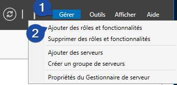

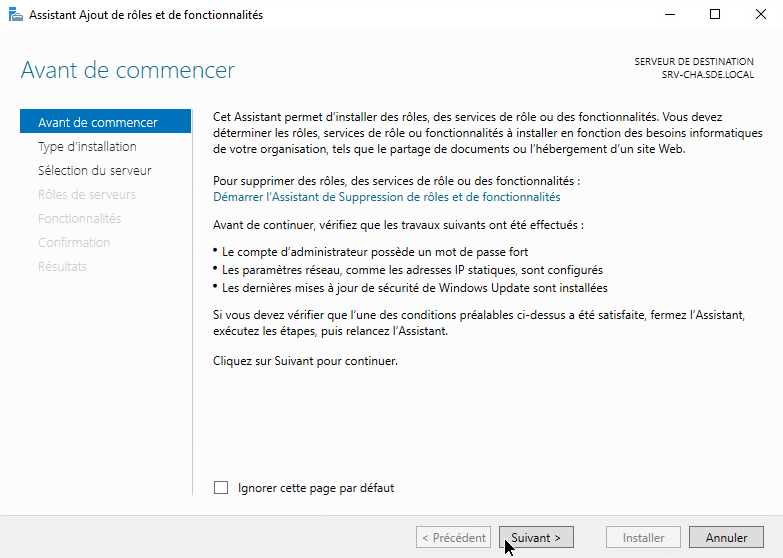

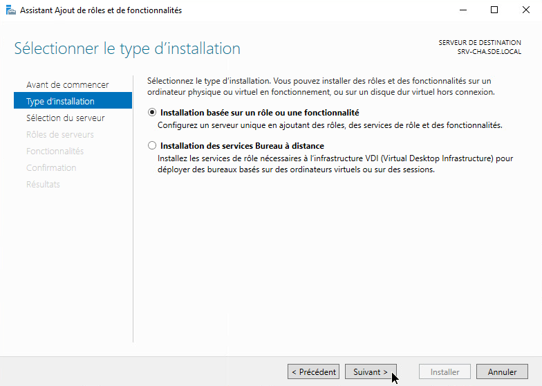

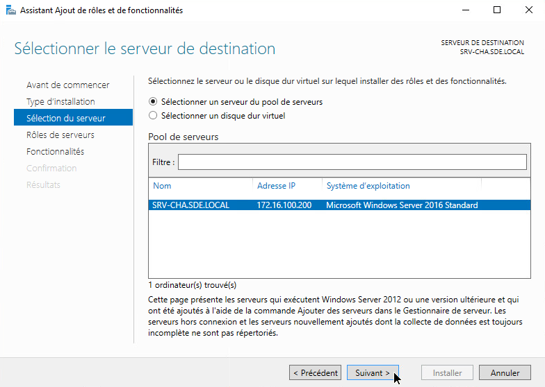

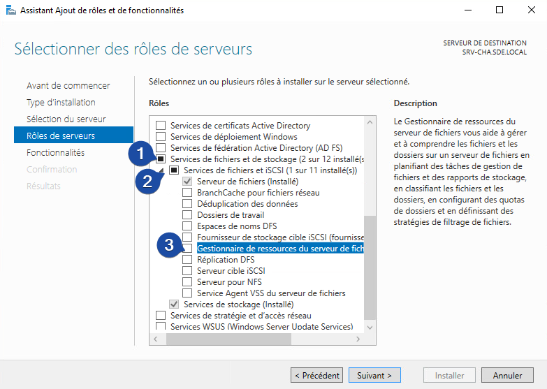

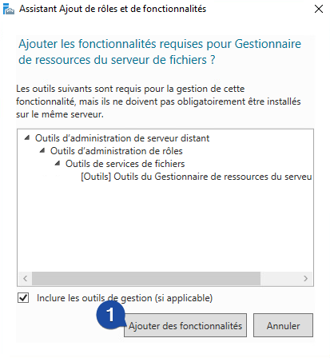

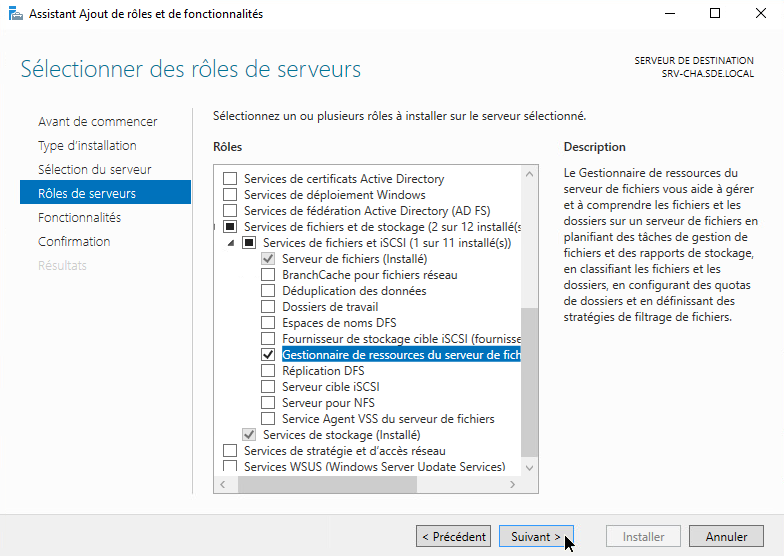

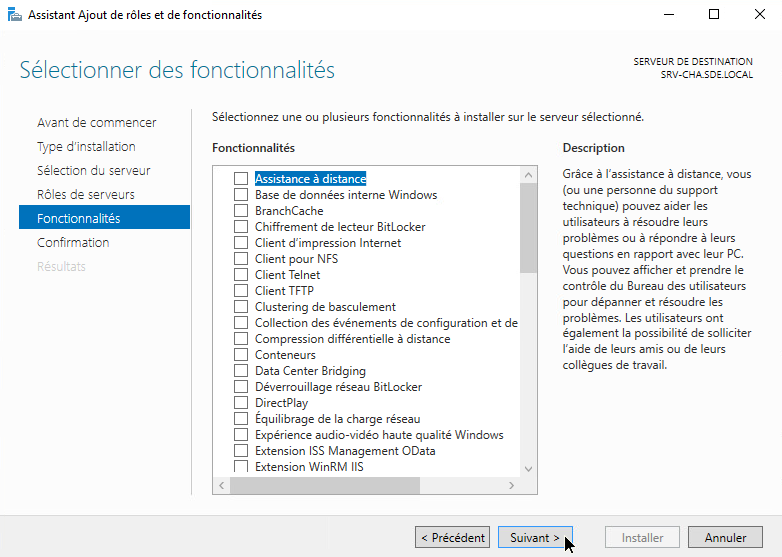

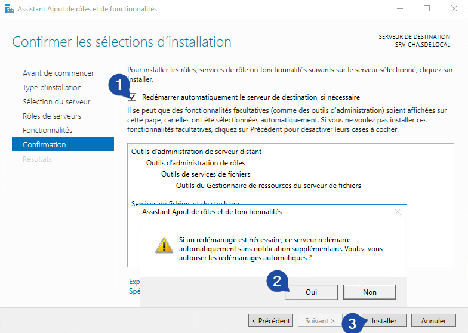

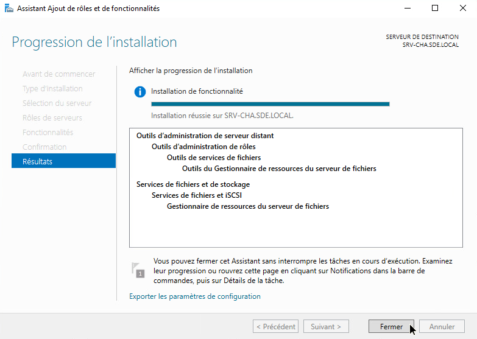

---

## :newspaper: Création d'un modèle de quota

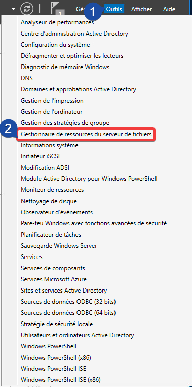

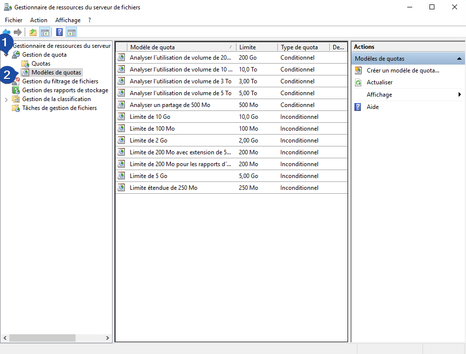

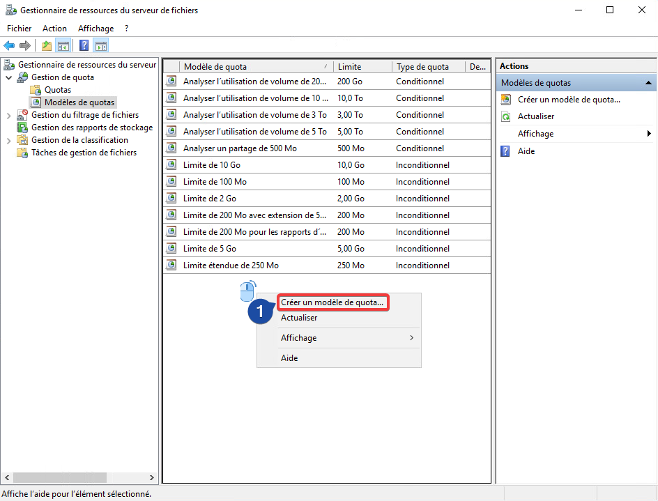

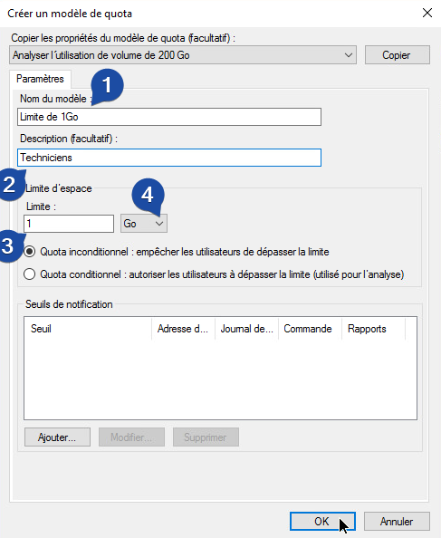

---

## :memo: Appliquation des quotas


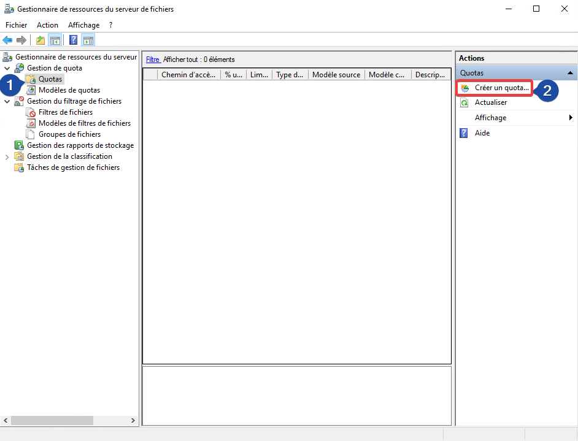

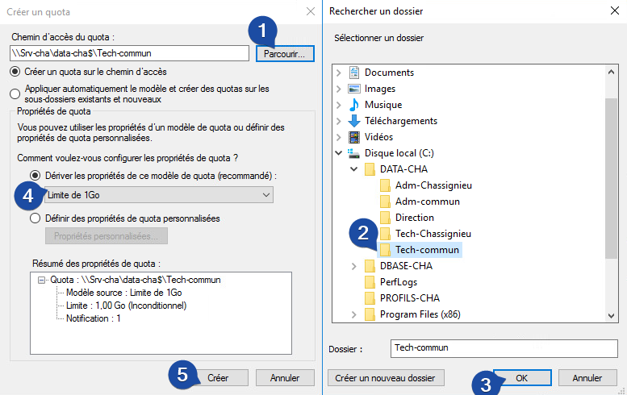

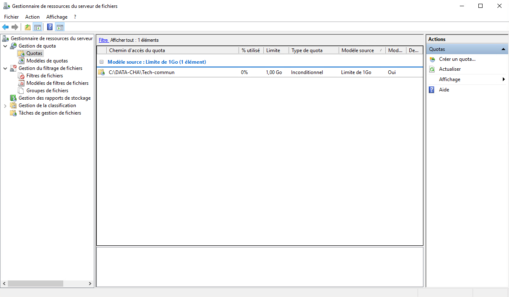

---

## :lock: Bonus: Appliquer des filtres

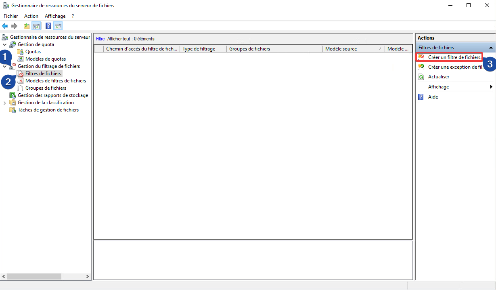

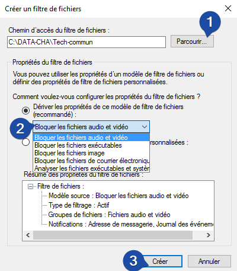

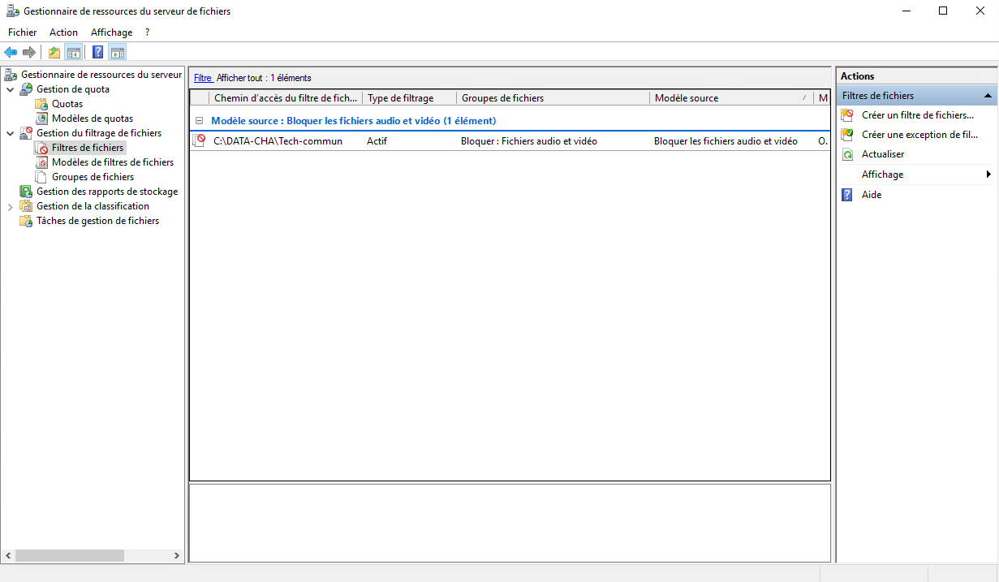

---


