# :icon-download: Installation d'un serveur active directory

Un Active Directory ou controleur de domaine, c'est un rôle ou une fonctionnalité ajoutée au serveur windows après sont installation.

Si vous n'avez pas encore installer votre serveur windows vous pouvez trouver un tutoriel étape par étape ici:

[!ref Installer un serveur windows server](https://windows.contactit.fr/windows-server/install-ws.md)

---

## :exclamation: Fixer l'adresse IP et le nom de la machine

---

---

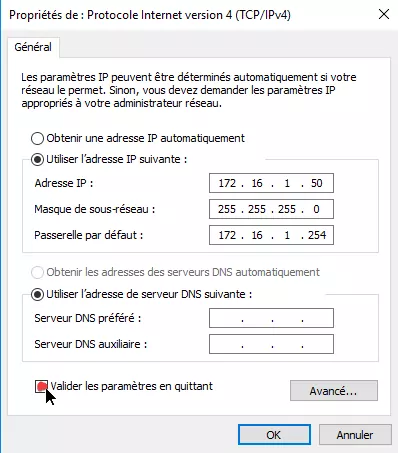

`Adresse IP:` `IP_AD`  
`Masque de sous-réseau:` `MASQUE_AD`  
`Passerelle par défaut:` `IP_PASSERELLE`  

:icon-info: Pour ce qui est du DNS celui-ci se mettra tout seul en loopback.
Quand le serveur windows serveur est promu contrôleur de domaine, il installe le rôle DNS automatiquement et devient donc, aussi son propre DNS

---

---

---

---

## Ajouter la fonctionnalité "AD DS"

!!!
Celle-ci ajoutera automatiquement la fonctionnalité DNS, puique l'AD en a besoin pour fonctionner.
!!!

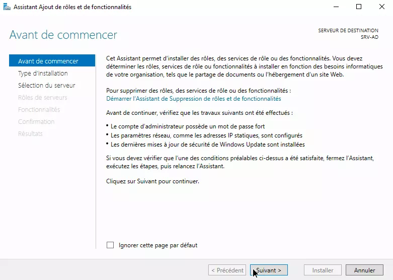

---

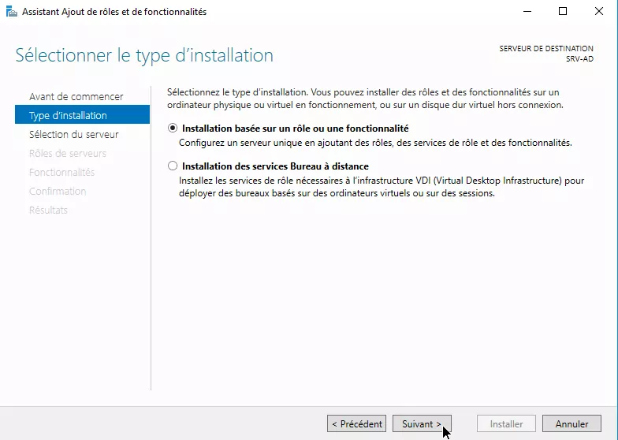

---

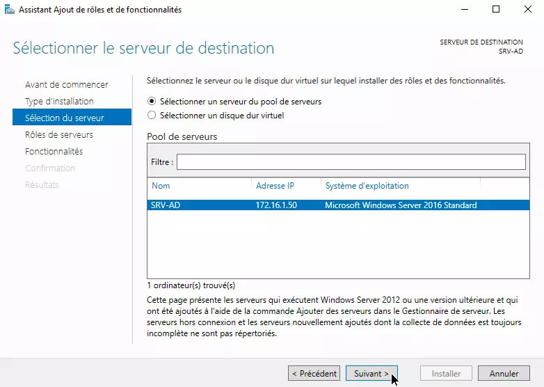

---

## :ballot_box_with_ballot: Promouvoir le serveur en contrôleur de domaine

!!!
Lors de la promulugation du serveur en contrôleur de domaine, celui-ci retire tous les utilisateurs locaux.
!!!

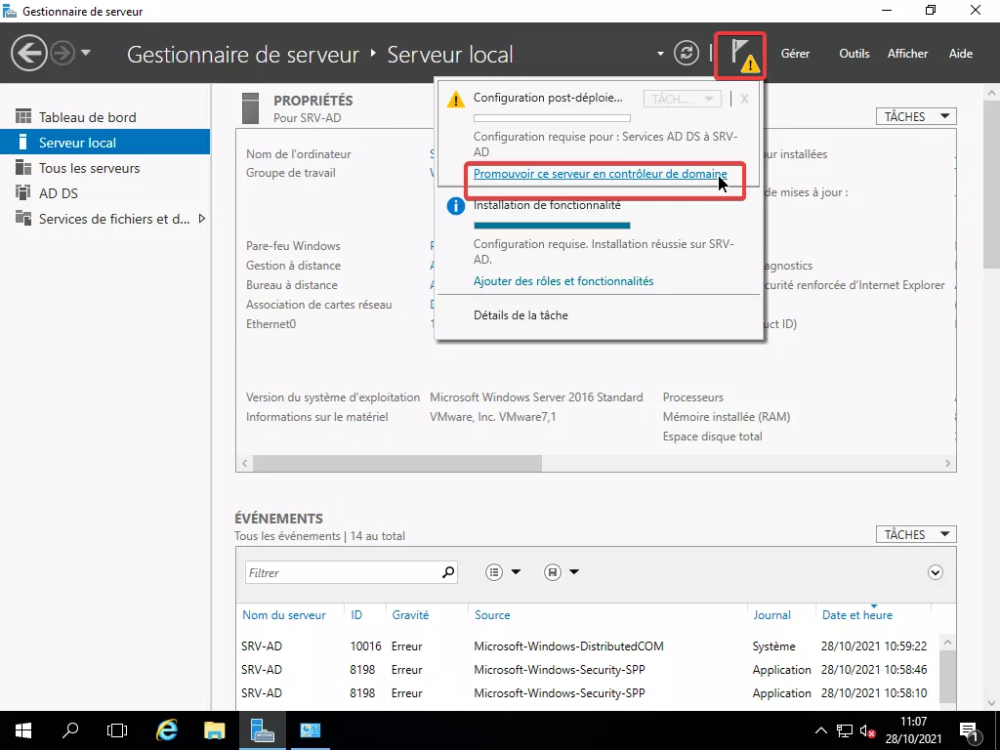

---

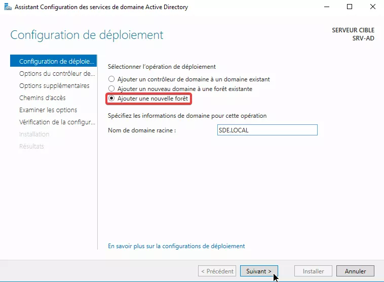

---

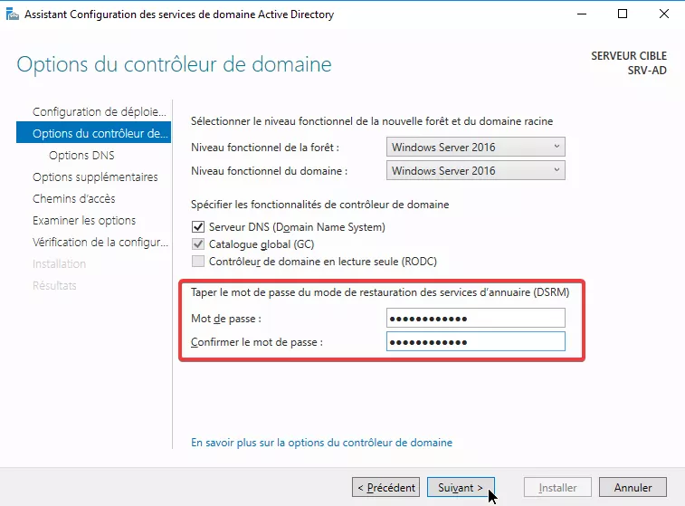

---

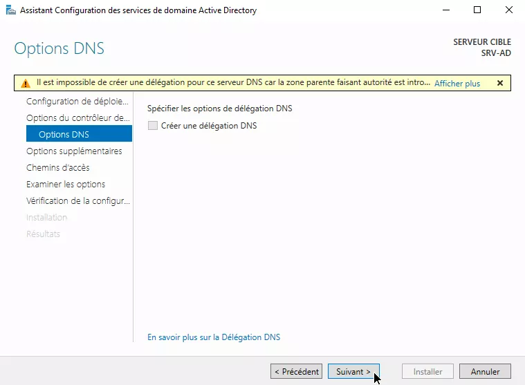

---

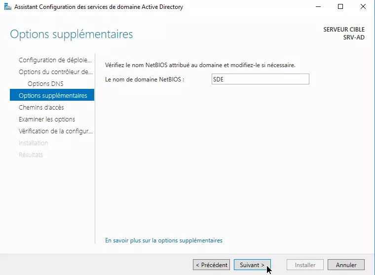

---

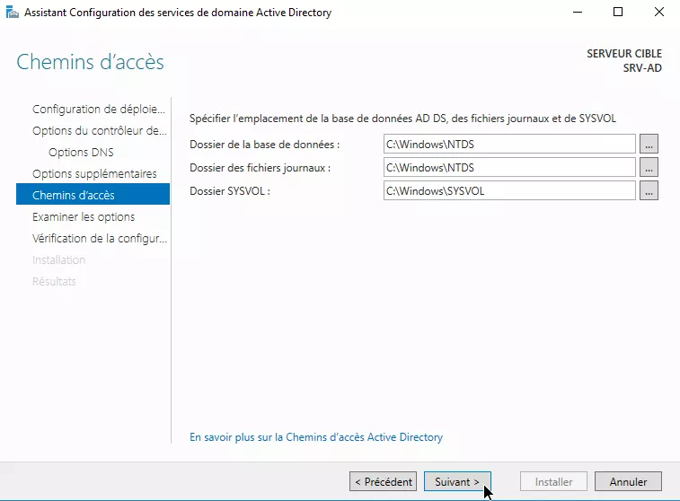

---

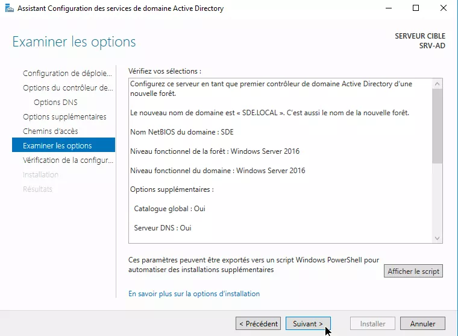

---

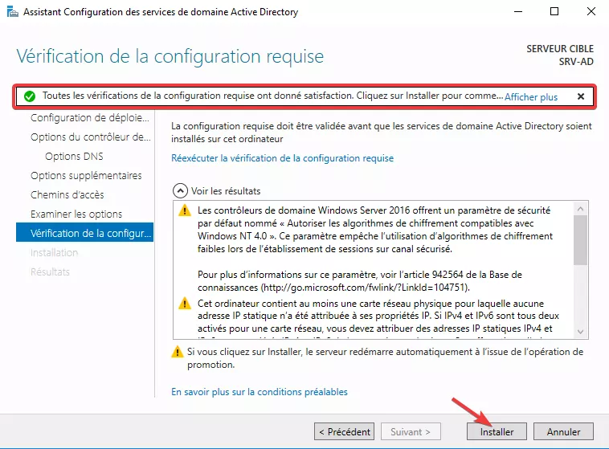

---

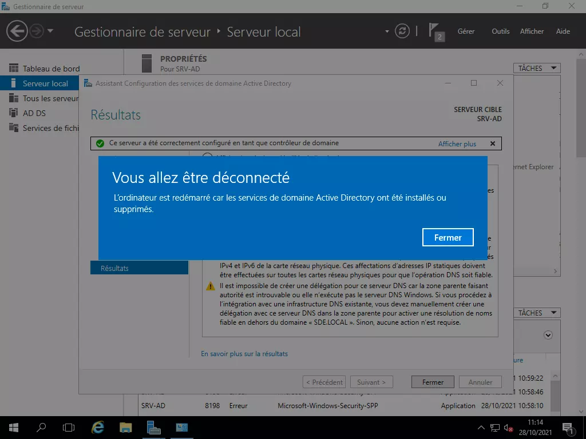

---

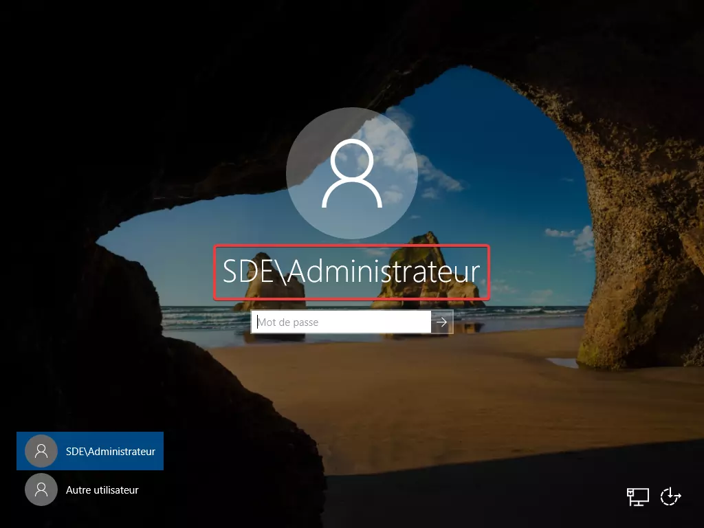

---

