# :icon-download: Installation d'un serveur RDS

---

## :heavy_plus_sign: Ajouter les rôles nécessaires

---

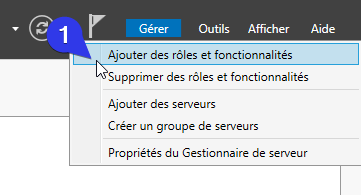

---

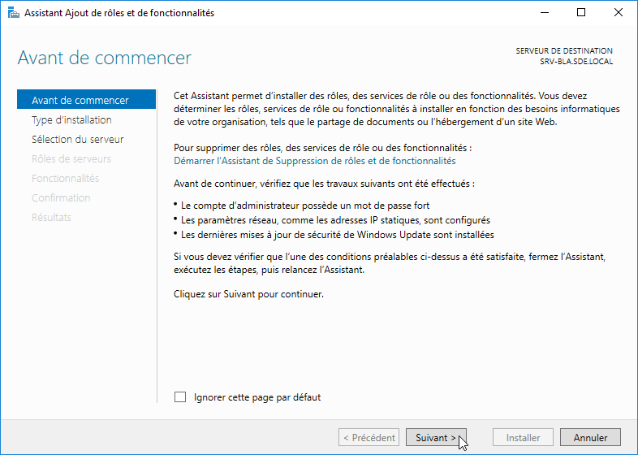

---

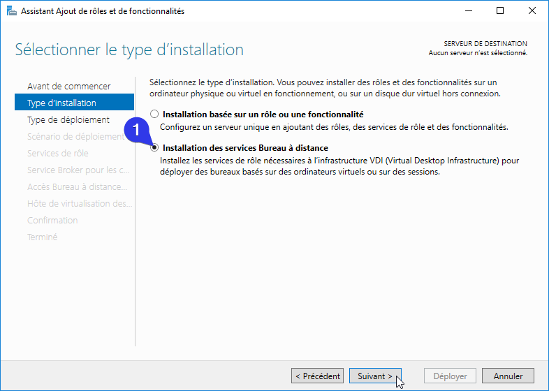

---

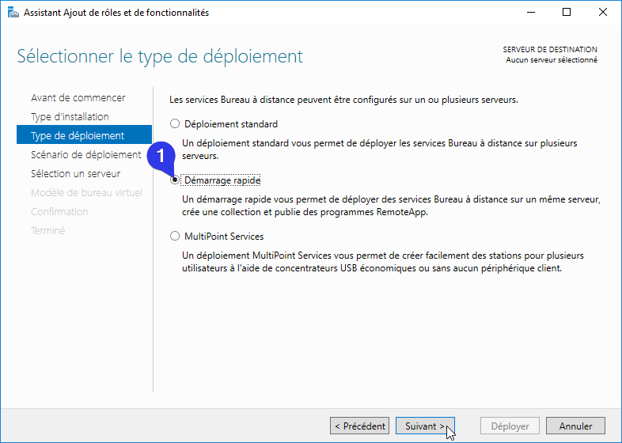

---

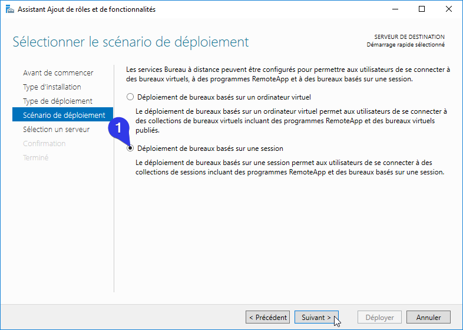

---

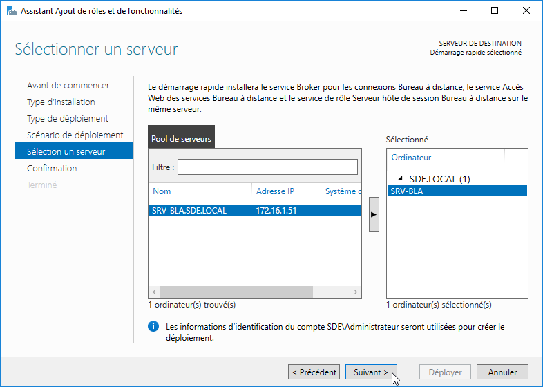

---

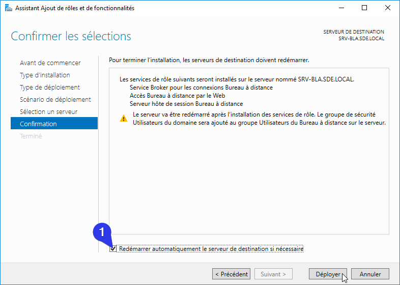

---

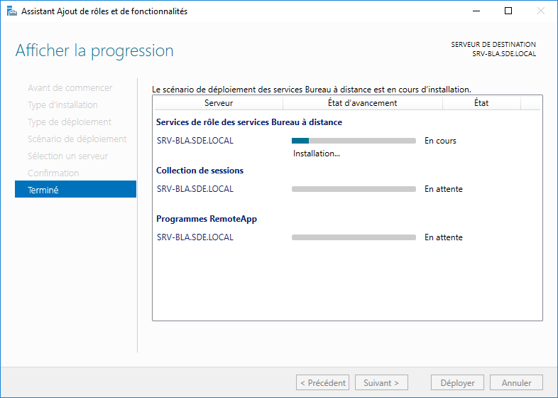

---

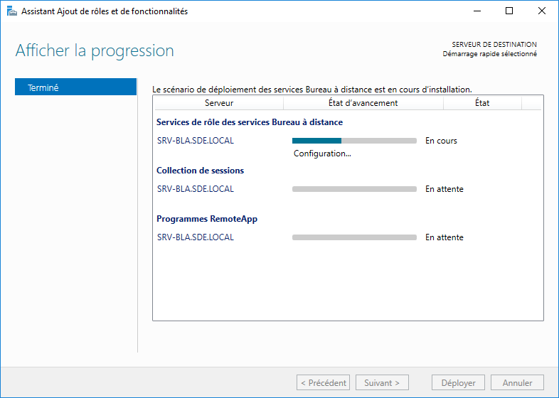

---

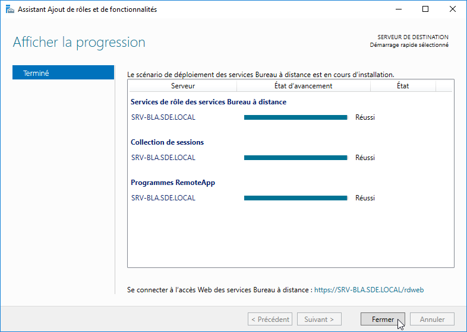

---

## :x: Désactiver l'authentification NLA

Permet de ne pas avoir le message d'erreur de certificat.

---

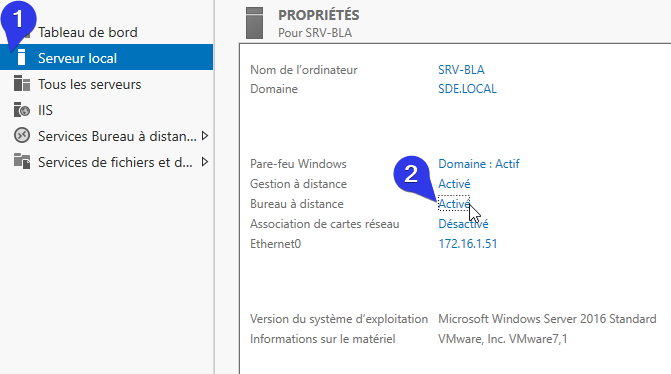

---

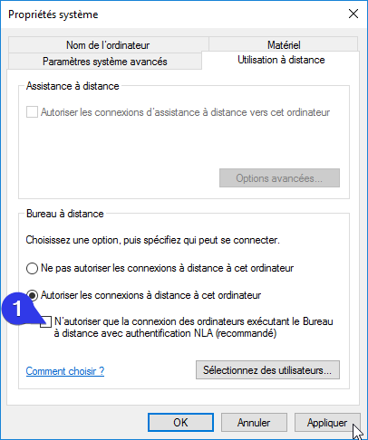

---

## :ballot_box_with_check: Connexion sur le client RDS

Vous pouvez maintenant tester votre serveur et vous connecter en bureau à disatance avec votre client.

---

---

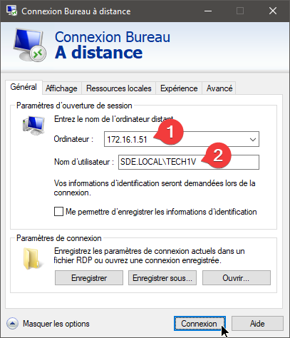

1. Renseigner l'adresse IP du serveur RDS  
2. Renseignler le nom de domaine \ nom d'utilisateur

---

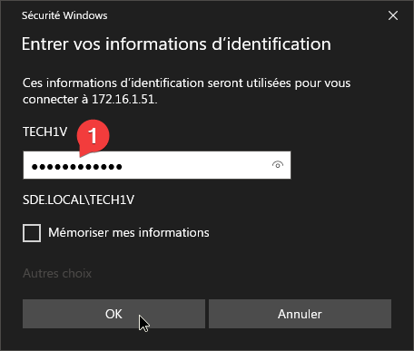

---

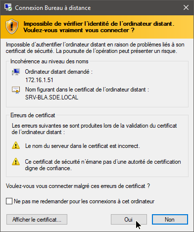

---

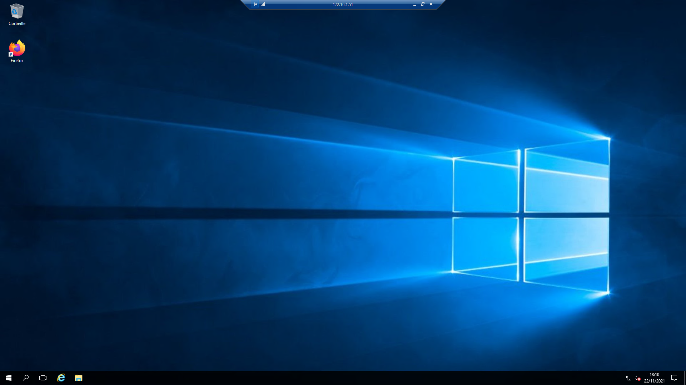

