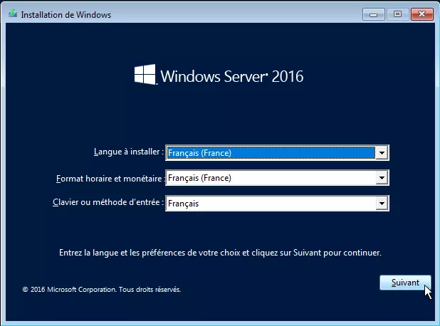
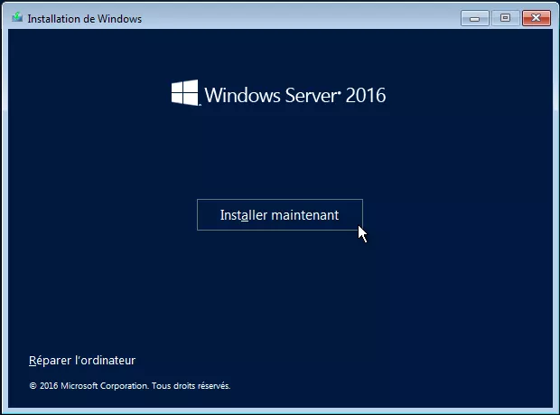
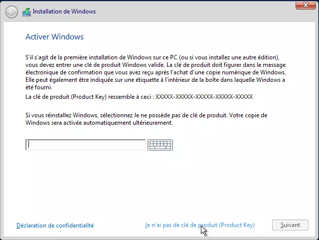
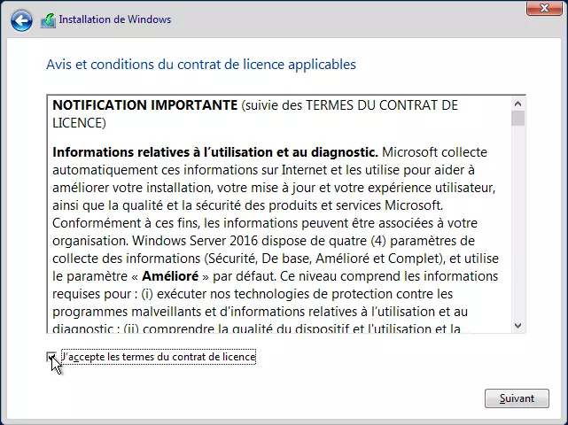
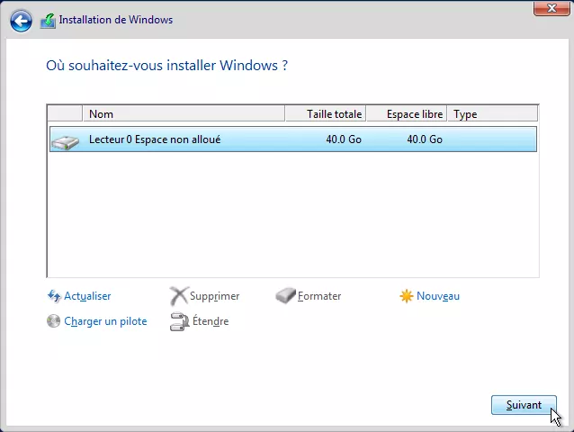
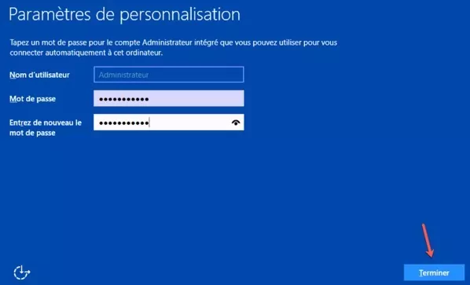

# :icon-download: Installation d'un serveur windows

:icon-info: Un Serveur windows permet à une entreprise de gérer un ou plusieurs rôles.  

:icon-chevron-right: Le `rôle` est un terme propre a windows server qui désigne une fonctionnalité ajoutée après son installation.  

=== Voici quelques rôles fréquemments utilisés:

 AD DS | DNS | DHCP
--- | --- | ---
Active directory (contrôleur de domaine) | Résolution de noms | Distribution de la configuration réseau (IP, DNS, Gateway, PXE...)  

||| Services de stockage (DFS)
Liens logiques de stockage et réplication
||| WSUS
déploiement de mises à jour
||| WDS
déploiement d'images systèmes
||| Hyper-V
Virtualisation de services
||| RDS
Prise de main à distance
|||

===

---

:icon-download: Télécharger l'ISO Windows Server (peux importe la version, ici 2016):
[!file icon="rocket" text="Télécharger l'ISO"](https://store7.gofile.io/download/793bfd9b-f35a-484b-a713-3875928a2e7f/W2K16.iso)

=== Il est conseillé la configuration minimum suivante:

||| CPU
2 Coeurs
||| RAM
2GB
||| DD
40GB
|||

===

!!!
Pour un serveur WSUS, il est recommandé de mettre le maximum de ressources possibles à votre machine.  
Ce rôle est très gourmand (Téléchargement et déploiement de grande quantités de données).
!!!

---

## :1234: Processus d'installation  

---

