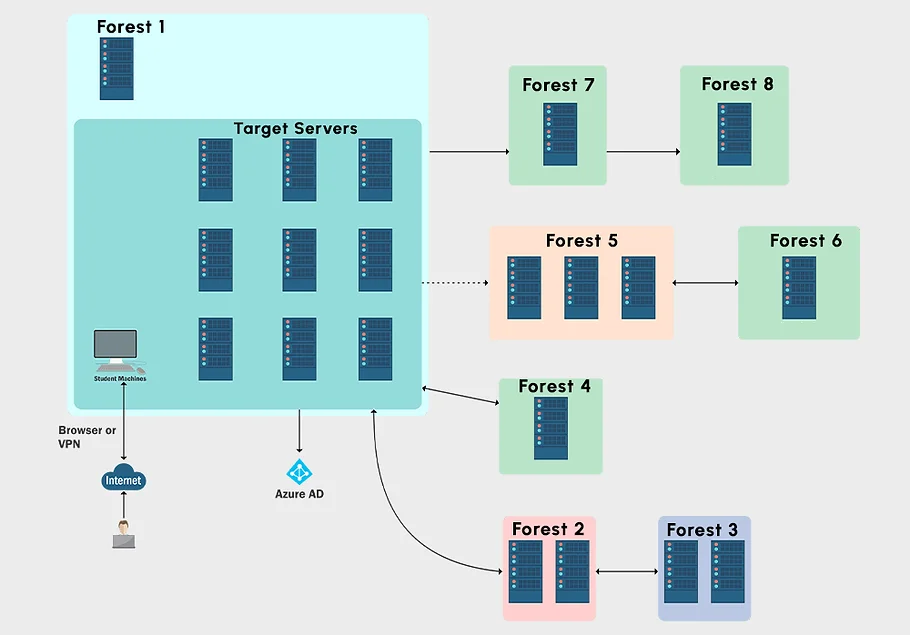

# 🛡️ Certified Red Team Expert

=== :icon-report: First DRAFT
!!! Warning This Experience feedback is actively written :writing_hand:
There might be some errors.  
If you notice any, please contact me [here](mailto:contactit.yarka@slmail.me) :slightly_smiling_face:
!!!
===

Feedback on Altered Security's "Certified Red Team Expert" certification.

## ▶️ Introduction

This certification follows on from the CRTP, for which I have already given feedback:

[!ref](CRTP/en.md)

It aims to deepen knowledge of Active Directory, particularly in an environment comprising several forests, evasion of security solutions (Defender, MDE, MDI) by obfuscation of binary/powershell scripts and fairly advanced opsec.

---

## 📕 Start

When you purchase CRTE ($300), you'll be asked to enter an email address. It's best to use a Gmail address (for the learner) to avoid having to contact support later, as authentication on the learning platform is done exclusively via a Google account.  

Altered Security learning platform interface](images/interface.webp)

:icon-milestone: You'll then have access to the various certification resources in the **"Access Lab Material "** section, which will redirect you to an onedrive link where you'll find diagrams, explanatory videos (CourseVideos correspond to bootcamp videos and WalktroughVideos to lab compromise paths), a **"LabManual_Covenant "** which covers the application of the course, but using a C2 (not up to date must be updated with sliver) and an archive containing all the tools needed to learn the certification (Tools. zip).  

:icon-alert: We strongly recommend reading the section **"Frequently Asked Questions"**.  

:icon-project-roadmap: In the course, there are 30 "Learning Objectives "**, each of which indicates a goal to be reached (one or more pieces of information to be filled in) by enumerating/exploiting the lab environment on a particular subject or to pivot to another machine. This covers everything from Kerberos recognition/enumeration/exploitation to attacks on certificates, the abuse of trust relationships between forests and the exploitation of SQL servers, while taking into account important noise and opsec management in order to bypass Defender and Microsoft defender for Endpoints/Identity (MDE/MDI). Beware of MDI behavioral detection! It may be wise to request only one ticket at a time, not to perform mass actions, not to dump the lsass process, to set random delays between actions... These elements are actively monitored by MDI !  

📍 The learning environment and the certification environment are similar, particularly in terms of security measures:
All servers are running **Windows Server 2019** (Not yet updated to 2022 as of date, there are no practical differences between the 2 versions of Windows Server) with the **security updates applied as of date**, the **firewall Windows and Defender are active**, some servers are in **"core "** version, plus security mechanisms like **WDAC/gMSA/LAPS**. A big step forward in terms of security compared to the PTRC environment. **The presence of misconfigurations/ACLs allows machines to be compromised.  

:icon-alert: As with CRTP, the bootcamp once again brings real added value to the course (LabManual.pdf). I'd even go so far as to say that this is what makes Altered Security so valuable: the feedback, the anecdotes, the detailed explanations of concepts; all of which can be heard in the bootcamp videos hosted by Nikhil (Founder of Altered Security).  

When you successfully complete all the learning objectives, you'll be able to download a certificate :  

---

## 💻 Exam

:icon-desktop-download: During the exam, the candidate will be asked to carry out a **command execution on the five machines in the lab** (at least 4 to pass the exam). Local administrator rights are not required on these machines, as no flags are to be collected. The candidate will have **48 hours**, including an extra hour to install the necessary tools, to compromise the entire lab and take screenshots attesting to the method of compromise employed, thus enriching the final report, which must be beyond reproach.  

icon-shield-check: **Microsoft Defender is active on all machines, MDE on one machine**. Defender can be disabled if you have local administrator privileges. For MDE, you will need to use the appropriate methodology to bypass it.  

!!! danger
Following feedback from students, Nikhil has agreed to integrate a workaround for MDE. However, it is important to note that this approach could become ineffective at any time. In fact, MDE is continually being enriched with new data and could, at any moment, block this bypass technique.
!!!

Techniques such as bruteforce, guessing, certificate abuse or exploitation of known vulnerabilities (CVE) are not useful during the examination.

---

## 📖 Report

:icon-project-roadmap: The report should be written entirely in **English**. Corrective measures should be suggested for any inappropriate configurations identified**, and references to **blog posts** should be added to reinforce the credibility of the document. It is also essential to explain how the tools used work and why they were chosen. My individual report was created using [sysreptor](https://github.com/Syslifters/sysreptor) and follows the following format:  

- **Title**
- **Summary**
- Compromise scheme** **Detailed description of the steps involved**
- **Detailed description of steps** **Remediations**
- **Remediations**
- Presentation of tools used**
- **References to blog articles consulted**
- **Conclusion**

---

## 📋 Conclusion

:icon-arrow-right: The CRTE requires a solid grounding in Active Directory penetration testing. If you've already passed the CRTP, or are a junior/professional in a pentest position with similar assignments, you're welcome to take the plunge.  

:icon-hourglass: It's quite possible to pass the CRTP in two weeks, the structure is broadly the same as the CRTP, but more complex with a larger environment too. **All resources are accessible for life**, including future updates. Please note, however, that **passing the certification is less complex than the training lab** (due to the latter's 48 hours of activity). You will then be asked to submit a **compromise report in English**, detailing all **observations, misconfigurations, tools used, sources of POC and remediation recommendations for each element in the environment** (recommendations earn more points, but are not mandatory). This report is written and sent within **48 hours maximum** after the end of the exam lab activity. You can also specify that English is not your native language, if this is a hindrance to your expression. The Altered Security team will take this into account when reviewing your report.

---