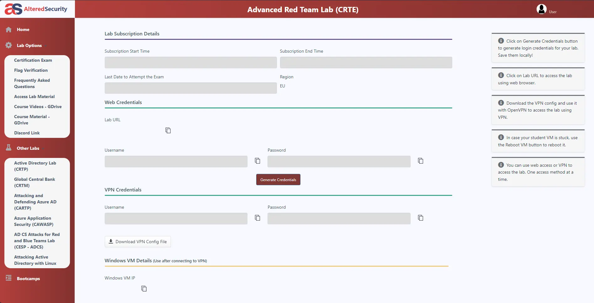

# 🛡️ Certified Red Team Expert review

Feedback on Altered Security's "Certified Red Team Expert" certification.

## ▶️ Introduction

This certification follows on from the CRTP, for which I have already given feedback:

[!ref CRTP feeback](https://docs.contactit.fr/certifications/crtp/en/)

It aims to deepen knowledge of Active Directory, particularly in an environment comprising several forests, evasion of security solutions (Defender, MDE, MDI) by obfuscation of binary/powershell scripts and fairly advanced opsec.

---

## 📕 Start

When you purchase CRTE ($300), you'll be asked to enter an email address. It's best to use a Gmail address (for the learner) to avoid having to contact support later, as authentication on the learning platform is done exclusively via a Google account.  

:icon-milestone: You'll then have access to the various certification resources in the **"Access Lab Material "** section, which will redirect you to an onedrive link where you'll find diagrams, explanatory videos (CourseVideos correspond to bootcamp videos and WalktroughVideos to lab compromise paths), a **"LabManual_Covenant "** which covers the application of the course, but using a C2 (not up to date must be updated with sliver) and an archive containing all the tools needed to learn the certification (Tools. zip).  

:icon-alert: We strongly recommend reading the section **"Frequently Asked Questions"**.  

:icon-project-roadmap: In the course, there are 30 "Learning Objectives "**, each of which indicates a goal to be reached (one or more pieces of information to be filled in) by enumerating/exploiting the lab environment on a particular subject or to pivot to another machine. This covers everything from Kerberos recognition/enumeration/exploitation to attacks on certificates, the abuse of trust relationships between forests and the exploitation of SQL servers, while taking into account important noise and opsec management in order to bypass Defender and Microsoft defender for Endpoints/Identity (MDE/MDI). Beware of MDI behavioral detection! It may be wise to request only one ticket at a time, not to perform mass actions, not to dump the lsass process, to set random delays between actions... These elements are actively monitored by MDI !  

📍 The learning environment and the certification environment are similar, particularly in terms of security measures:
All servers are running **Windows Server 2019** (Not yet updated to 2022 as of date, there are no practical differences between the 2 versions of Windows Server) with the **security updates applied as of date**, the **firewall Windows and Defender are active**, some servers are in **"core "** version, plus security mechanisms like **WDAC/gMSA/LAPS**. A big step forward in terms of security compared to the PTRC environment. **The presence of misconfigurations/ACLs allows machines to be compromised.  

:icon-alert: As with CRTP, the bootcamp once again brings real added value to the course (LabManual.pdf). I'd even go so far as to say that this is what makes Altered Security so valuable: the feedback, the anecdotes, the detailed explanations of concepts; all of which can be heard in the bootcamp videos hosted by **Nikhil Mittal** (Founder of Altered Security) and **Munaf Sahriff** now.

---

## 💻 Exam

:icon-desktop-download: **I must remain somewhat vague to avoid spoiling the exam setup.** During the exam, the candidate's mission is to successfully execute commands on the machines within the lab scope (at least 4 to pass the exam, excluding the provided VM). It is not required to obtain local administrator rights on these machines, as no flags need to be collected. The candidate will have **48 hours**, including an additional hour for installing necessary tools, to compromise almost the entire lab and take screenshots that demonstrate the method used, thus enhancing the final report, which should be as flawless as possible.  

:icon-shield-check: **Microsoft Defender is active on all machines**. Defender can be disabled if you have local administrator privileges, but according to the course, you must bypass Defender at least once.

!!! danger
Following student feedback, Nikhil has agreed to include a method for bypassing MDE. However, it is important to note that this approach could become ineffective at any time. Indeed, MDE is continuously updated with new data and could block this bypass technique at any moment.
!!!

During the exam, techniques such as brute force, guessing, bypassing MDE, abusing certificates, or exploiting known vulnerabilities (CVE) are not useful.

After starting the exam, the list of machines appeared on the interface within about ten minutes. It is now necessary to generate the credentials to connect to the first machine, as Altered Security certifications are based on an "Assumed Breach" scenario. Remember that Windows Defender is active, so you will need to perform privilege escalation and/or enumeration considering this element. I was able to escalate my privileges, disable protections on the machine for greater ease, dump lsass, and enumerate the current domain.

The first and second movements require time, logic, specific enumeration, and research/documentation. I was able to complete them after a few hours, while drafting the report with screenshots.

The third movement is easily identifiable after enumerating the forest we are now in. I was able to exploit it quickly and compromise it.

For the fourth movement, I had to juggle between the enumeration elements of the two forests to find the next step. The path was then clear: the four machines were accessible, and for the last one, the attack vector was a formality.

There are indeed five machines in the lab, but the difficulty and time required per movement can be significant. The initial movements are not necessarily straightforward and can include many steps, sometimes causing frustration, especially if blocked on the first machine to compromise. It is important not to forget to read the tool documentation, consult usual cheatsheets (hacktricks, thehacker.recipes), and above all, to test.

---

## 📖 Report

:icon-project-roadmap: The report must be written entirely in **English**. It should suggest **corrective measures for the identified misconfigurations** and include references to **blog articles** to enhance the credibility of the document. It is also essential to explain the functionality of the tools used and the reasons for their selection. My individual report was created using [sysreptor](https://github.com/Syslifters/sysreptor) and the [Altered-Security-Reporting](https://github.com/didntchooseaname/Altered-Security-Reporting) template, which I developed with the help of two contributors based on the calzone template. The project's goal is to save time on formatting, automate elements such as the structure of the Executive Summary and Table of Contents, and most importantly, focus on completing only the *functional* parts of the document, such as the *scope* and *attack vectors*.

---

## 📋 Conclusion

:icon-arrow-right: The CRTE requires a solid grounding in Active Directory penetration testing. If you've already passed the CRTP, or are a junior/professional in a pentest position with similar assignments, you're welcome to take the plunge.  

:icon-hourglass: It's quite possible to pass the CRTE in two weeks, the structure is broadly the same as the CRTP, but more complex with a larger environment too. **All resources are accessible for life**, including future updates. Please note, however, that **passing the certification is less complex than the training lab** (due to the latter's 48 hours of activity). You will then be asked to submit a **compromise report in English**, detailing all **observations, misconfigurations, tools used, sources of POC and remediation recommendations for each element in the environment** (recommendations earn more points, but are not mandatory). This report is written and sent within **48 hours maximum** after the end of the exam lab activity. You can also specify that English is not your native language, if this is a hindrance to your expression. The Altered Security team will take this into account when reviewing your report.

---