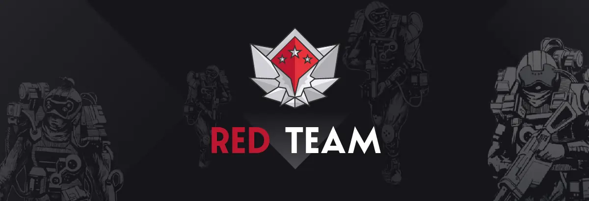
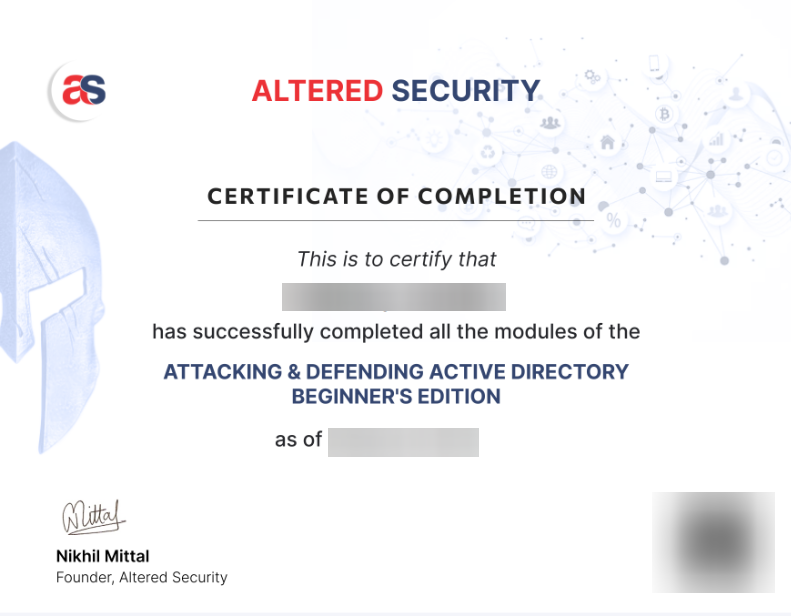

# 🛡️ Certified Red Team Professionnal

Retour d'expérience sur la certification "Certified Red Team Professional" par Altered Security.

## ▶️ Introduction

**Altered Security** (anciennement Pentester Academy) a été fondé par **Nikhil Mittal** Et propose des certifications axées **sécurité offensive** (Red Team) sur les environnements **Active Directory**. Nikhil est reconnu mondialement pour son expertise en Red Team sur les environnements Active Directory, il a d'ailleurs pu donner de nombreuses conférences comme celles à la DefCon [RACE - Minimal Rights and ACE for Active Directory Dominance](https://www.youtube.com/watch?v=F_Fy7M1AO_Q), [Powershell for Penetraton Testers](https://www.youtube.com/watch?v=PezFo2Y1BUA) ou [PowerPreter Post Exploitation Like a Boss](https://www.youtube.com/watch?v=NXydblaJaZQ).

Les certifications qu'il propose avec Altered Security sont **reconnues** (en France également), en particulier par les **entreprises spécialisées** (type ESN proposant des services de test d'intrusion à leurs clients).

---

## 📕 Le début

Lorsque vous achetez la CRTP (249$ ou 300$ avec le bootcamp) vous devez renseigner une adresse email, mettre une **adresse Gmail vous épargnera de devoir contacter le support par la suite**, puisque l'authentification à la plateforme d'apprentissage se fait uniquement via un **compte google**.

Vous aurez donc accès aux différentes ressources de la certification dans la section **"Access Lab Material"**, qui vous redirigera vers un lien onedrive dans lequel vous retrouverez les diagrammes, les vidéos éxplicatives (:warning: différents du bootcamp), le **"Lab Manual"** qui est le cours principal (même chôse que la section "Lab Manual"), le dossier **"Sliver_C2"** qui concerne l'application du cours, mais en utilisant le C2 et une archive renfermant tous les outils nécessaires à l'apprentissage de la certification.  

Il est fortement recommandé de lire la section **"Frequently Asked Questions"** qui comme son nom l'indique, répondra à beaucoup de vos questions.

Concernant le cours, il y a **24 "Objectifs d'apprentissage"**, chacun d'entre eux vous indique un objectif à atteindre (une ou plusieurs informations à renseigner) par l'énumération/exploitation de l'environnement du lab.

Celui-ci couvre de la reconnaissance/énumération/exploitation Kerberos aux attaques sur les certificats et l'exploitation de serveurs SQL tout en prenant en compte la gestion du bruit et de l'opsec.

L'environnement d'apprentissage et celui du passage de la certification sont très similaires notamment au niveau des mesures de sécurité :
Tous les serveurs sont sous **Windows Server 2022** avec les **mises à jour de sécurité appliquées en date**, le **firewall Windows et Defender sont actifs**, certains serveurs sont en version **"core"** et il y a des politiques **applocker**. Autant dire que le niveau de sécurité est important par rapport à un environnement de production d'une PME.

L'entrée en matière de la CRTP commence d'ailleurs, avec le **contournement de ces protections**.  

-> TODO  

Quand vous compléterez l'ensemble des objectifs d'apprentissage avec succès, vous pouvez télécharger un certificat :

---

## 🛠️ Le bootcamp

Je recommande fortement de prendre le bootcamp (lives et vidéos) en complément de la certification si vous êtes débutant dans le domaine du Red Teaming et d'Active Directory. Le bootcamp se compose de 4 sessions vidéos en live avec Nikhil chaque dimanche pendant 4 heures (les rediffusions sont disponibles et téléchargeables).  

Il ajoute une réelle plus-value à l'apprentissage et permet d'avoir des bases solides et ira vraiment plus loin que le cours de la plateforme. Notamment en allant plus en profondeur dans les concepts de gestion des logs Windows et du bruit, afin de rester le plus possible non détecté par les solutions de sécurité. Cela passe par l'obfuscation de scripts communs comme "Mimikatz", la désactivation/Neutralisation des mesures de sécurité liées à PowerShell (ScriptBlock logging, Module logging, Transcription, AMSI) jusqu'à l'explication de chaque argument passé aux commandes et l'obfuscation de ceux-ci également.  

La gestion du bruit est un élément qui vous suivra tout au long de ce bootcamp et Nikhil ne manquera pas de vous rappeler son importance et de vous donner à chaque fois plusieurs exemples sur le lab pratique. Il sera également à votre écoute et n'hésitera pas à lire vos questions dans le tchat, il vous en posera également à son tour, nous avons donc un réel échange entre l'enseignant et les étudiants. Le serveur Discord prévu à cet éffet centralisera les différentes informations du bootcamp et vous permettra également d'échanger avec les différents apprenants.

Dans le package de la certification vous avez également un accès à une instance Microsoft defender for Endpoints (MDE) sur le périmètre qui vous permet de voir également une partie de la vue du côté défense. Mais également aussi une explication claire et détaillée de tous les outils utilisés et des paramètres rentrés en fonction de l'environnement.  

---

## 📋 Conclusion

Avec des bases solides et un investissement conséquent, il est possible de passer la CRTP en (en moyenne) deux semaines. Toutefois si vous prenez un accès de 30 jours au Lab, vous bénéficierez de deux semaines supplémentaires offertes. Toutes les ressources sont accessibles à vie y compris les futurs mise à jour.

---