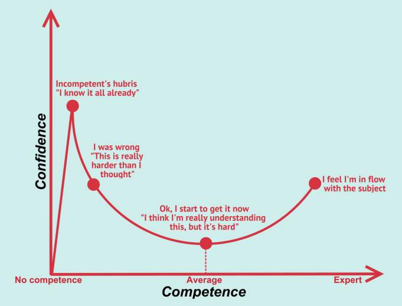

# :zany_face: La cybersécurité et l'effet Dunning-Kruger

L’effet Dunning-Kruger est un type de biais cognitif dans lequel les personnes pensent qu’elles sont plus "intelligentes" et plus "capables" qu’elles ne le sont en réalité, cet effet peut avoir des implications significatives.  

En d’autres termes, les personnes ayant un faible niveau de compétence ne possèdent pas les compétences nécessaires pour reconnaître leur propre incompétence. Cette combinaison de mauvaise conscience de soi et de faible capacité cognitive les amène à surestimer leurs capacités.

---

## L'Effet Dunning-Kruger en Cybersécurité : Les Risques de la Surestimation et de la Sous-estimation

### Introduction

Dans le monde de la cybersécurité, la compréhension précise de ses compétences est cruciale pour la protection efficace des systèmes d'information. L'effet Dunning-Kruger, du nom des psychologues David Dunning et Justin Kruger qui l'ont identifié, met en lumière une **dynamique comportementale** où les individus mal informés ou inexpérimentés dans un domaine ont tendance à surestimer leurs compétences.

### Surestimation et Vulnérabilités

Les **acteurs malveillants** exploitent souvent cette surestimation pour mener des attaques réussies. **Un individu surestimant ses compétences en matière de cybersécurité peut négliger des pratiques de base**, comme la mise à jour régulière des logiciels ou la gestion des mots de passe, ce qui crée des vulnérabilités exploitées par les cybercriminels.

### Sous-estimation et Potentiel Inexploité

À l'inverse, les experts en cybersécurité expérimentés peuvent parfois sous-estimer leurs compétences, hésitant à adopter de nouvelles technologies ou pratiques par crainte de mal les comprendre. Cela peut conduire à un potentiel inexploité dans l'utilisation de solutions plus avancées et sécurisées.

### Gestion de l'Effet Dunning-Kruger

La gestion de l'effet Dunning-Kruger nécessite une approche équilibrée. Les équipes de cybersécurité doivent encourager la formation continue et **la prise de conscience des compétences réelles**. La mise en place de programmes de mentorat et de partage de connaissances peut aider à réduire les écarts entre la perception des compétences et la réalité.

La clé pour surmonter l'effet Dunning-Kruger en cybersécurité est ce que les chercheurs appellent la métacognition, ou la réflexion sur la réflexion. Il est important de se poser des questions, de prêter attention aux hypothèses et de rechercher des connaissances⁵. La confiance peut diminuer, mais la compétence augmentera⁵.

### Conclusion

En conclusion, la compréhension de l'effet Dunning-Kruger en cybersécurité est essentielle pour renforcer la posture de sécurité. La prise de conscience des compétences réelles, combinée à une éducation continue, peut aider à atténuer les risques liés à la surestimation et à la sous-estimation. La cybersécurité, en tant que discipline en constante évolution, exige une humilité intellectuelle constante pour faire face aux défis croissants de la menace cybernétique.

*Sources* : 

1. **Dunning, D., & Kruger, J. (1999).** Unskilled and unaware of it: How difficulties in recognizing one's own incompetence lead to inflated self-assessments.

2. **Smith, R. D. (2018).** Cybersecurity and the Dunning-Kruger Effect: A Metacognitive Perspective.

3. **OpenAI.** ChatGPT.

4. **The Dunning-Kruger Effect and Why It Convolutes Cybersecurity.** https://truedigitalsecurity.com/blog/dunning-kruger-cybersecurity.

5. **Microsoft.** Co-pilot

6. **verywellmind.com** https://www.verywellmind.com/an-overview-of-the-dunning-kruger-effect-4160740