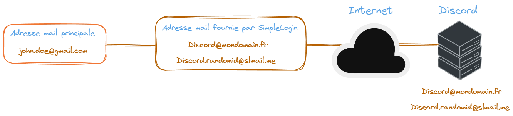
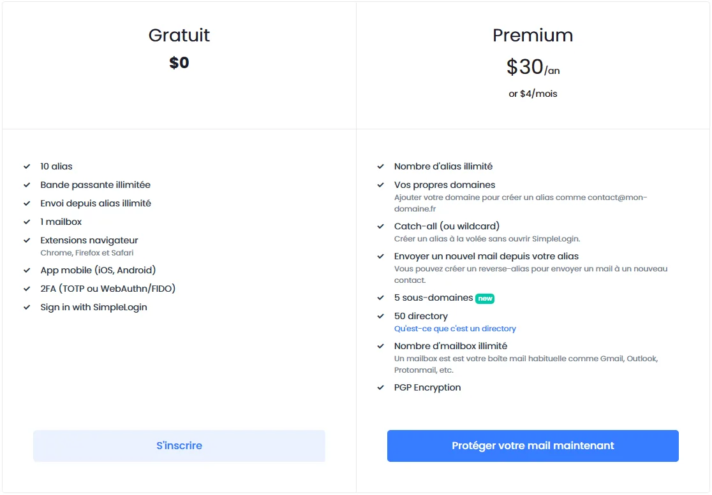
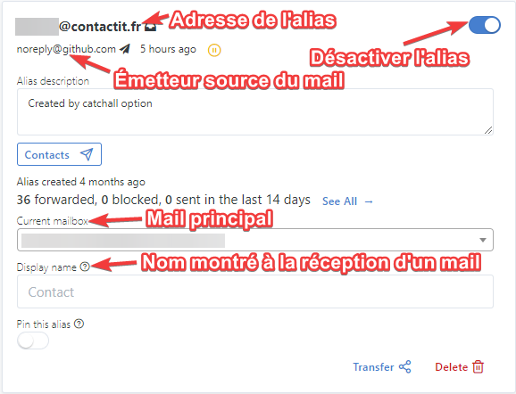

# :incoming_envelope: Les Alias mails, recevoir et envoyer des mails sans compromettre son identité.

==- :wrench: Révisions

Date | Changes
--- | ---
15/06/2023 | Révisions
21/08/2023 | Révisions 
20/08/2023 | Initial push

===

!!!danger
Les alias mails avec les '+' ne seront pas traités dans cet article, beaucoup de sites bloquent l'usage des caractères spéciaux dans l'adresse mail et quand bien même ajouter un plus à l'adresse, celle-ci reste visible.
!!!

:information_source: Un alias mail fonctionne de manière similaire au transfert de mails. Un intermédiaire se charge de recevoir le mail et de le tranférer au destinataire.  

:arrow_right: Ici, c'est donc un service intermédiaire qui va se charger de faire ces tâches de manière transparente. Pour citer les 2 services d'alias mails les plus connus : <a href="https://simplelogin.io" target="_blank">SimpleLogin (by Proton)</a> et <a href="https://addy.io" target="_blank">Addy (précédemment AnonAddy)</a>. Ces services proposent d'ailleurs 15 adresses (alias) mails pour leurs plans gratuits respectifs. Ce n'est donc plus votre adresse mail principale que vous allez donner à un service, une personne ou lors de votre inscription, mais plutôt une adresse unique générée par le biai du service en question. Ce qui revient à scinder vos identités liées à vos adresses mails, puisqu'en plus de pouvoir choisir le début de l'adresse mail générée, vous pouvez également mettre n’importe quel nom de contact (celui-ci sera affiché lors de la réception d'un mail de votre part).  

---

## :white_check_mark: Les avantages

- Dans le cas d'un leak d'un service, le mail principal ne fuite pas.
- Votre adresse mail principale reste inconnue de vos destinataires. Vous possédez plusieurs adresses facilement manageables.  
- Possibilité de désactiver ou supprimer une adresse en cas de spam.  
- Prise en charge de la fonctionnalité catch-all pour votre domaine.  
- Possibilité de transférer les mails reçus d'un alias mail, vers plusieurs adresses mails automatiquement (liste de diffusion).  
- Génération des alias facilitée avec l'extension.  
- Intégration et génération des mails incluent dans ProtonPass (SimpleLogin).

---

## :x: Les inconvénients 

- Dépendance au service pour les mails utilisés.  
- Confiance du service dans le transport des mails.  
- Limite de mails, bande passante et quotas limités pour les envois/réceptions (Addy.io).  
- Limite de taille des pièces jointes à 25 Mo (Si vous dépassez cette taille de fichier utilisez un service de partage de fichiers comme <a href="https://www.swisstransfer.com" target="_blank">SwissTransfer</a>.

==- :icon-shield-x: Est-ce que les adresses mails continuent de fonctionner après la fin de mon abonnement ? 

SimpleLogin continue à vous proposer ses services même après la fin de votre abonnement :  

>When your subscription ends, all aliases you created continue working normally, both on receiving and sending emails. Concretely:
>- All aliases/domains/directories/mailboxes you have created are kept and continue working normally.
>- You cannot create new aliases if you exceed the free plan limit, i.e. have more than 10 aliases.
>- As features like catch-all or directory allow you to create aliases on-the-fly, those aliases cannot be automatically created if you have more than >10 aliases.
>- You cannot add new domain, directory or mailbox.  
>
>For example, if you have 100 aliases by the time your subscription ends, these 100 aliases will continue receiving and sending emails normally. You >cannot however create new aliases.

===

---

## :dollar: Les prix et fonctionnalités 

SimpleLogin | Addy
:---: | :---:
 | 

:arrow_right: Je recommande SimpleLogin qui présente le plus de fonctionnalités par rapport à ses concurrents. De plus, le service a été racheté par Proton et est gratuit (avec premium) pour les abonnés.

---
