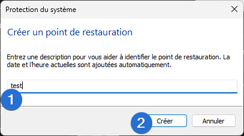
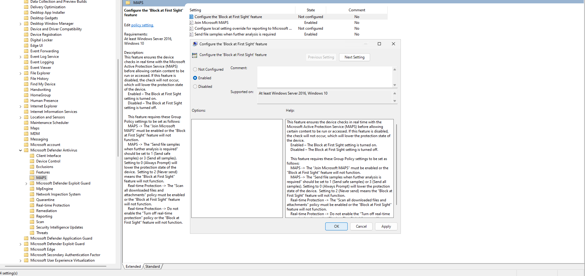
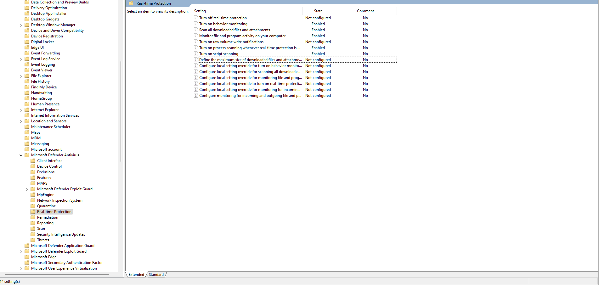

# :shield: Maximiser la protection de Windows Defender

==- :wrench: Révisions

Auteur | Date | Changes
--- | --- | ---
contactit.fr | 01/09/2023 | Initial push

===

Windows Defender est l'organe **natif** de **sécurité** des distributions **Windows**. Souvent considéré comme étant "peu efficace", sont potentiel réél est mal connu. Ce que l'on peut reprocher à Defender en revanche, c'est d'être un peux trop **minimal** au niveau de la protection offerte **par défaut** sur les machines.  

C'est tout à fait compréhensible, puisque comme à son habitude, Windows se doit d'être : rétro compatible, de coller au maximum de cas d'usages possibles. C'est pourquoi Windows a jugé pertinent la configuration basique qui est effective pour tout le monde. Comme nous le savons tous **les utilisateurs ne vont que très rarement faire un tour des paramètres.**  

**Plus la sécurité du système sera avancée et plus il y a de risque de rencontrer des éléments bloquants pour l'utilisateur.** C'est une balance constante avec laquelle, tout le personnel des équipes informatique joue en permanence.  

!!!warning L'informatique change !
Il est important de souligner que l'informatique change constamment et que le système à un cycle de vie, des vulnérabilités, des mises à jour. Ces éléments peuvent générer des instabilités et nécessitent une maintenance importante.    
!!!

Le schéma suivant résume bien la sécurité informatique de manière générale. Ca sera donc à vous, tout au long de ce tutoriel de définir votre "niveau de sécurité" en fonction de vos besoins et d'en accepter les potentielles conséquences ! C'est pourquoi **il est impératif de sauvegarder ses données avant toute action**.

[!badge size="l" icon="alert" variant="danger" text="**Créez un point de réstauration Windows en premier lieu !**"]

==- :icon-question: Comment faire ?

+++ :one: Rechercher "Créer un point de restauration" dans le menu démarrer de Windows.

+++ :two: Cliquer sur créer.

+++ :three: Nommer et créer le point de restauration.

+++ :four: Point de restauration en cours de création...

+++ :five: Fermer la fenêtre.

+++

===

---

## ⚠️ Paranoïd setup

Cette configuration augmente de manière significative l'utilisation des ressources (CPU/RAM) de la machine.  
Il est nécessaire d'avoir une copie **Windows 10/11 professionnel** ou plus, valide afin de suivre cette procédure.  

Rendez-vous dans les **"Group Policy Objects"** depuis le menu démarrer par exemple, puis dans `Computer Configuration > Administrative Templates > Windows Components > Microsoft Defender Antivirus`. Toutes les configuration pésentées sont dans cette arborescence d'objets. Les objets en **"Enabled"** sont à activer manuellement en suivant les captures d'ecran ci-dessous.  

:icon-arrow-right: Sous la section **"MAPS"** :  

:icon-arrow-right: Sous la section **"MpEngine"** :  

:icon-arrow-right: Sous la section **"Real-Time Protection"** :  

:icon-arrow-right: Sous la section **"Scan"** :  

:icon-arrow-right: Sous la section **"Security Intelligence Update"** :  

---