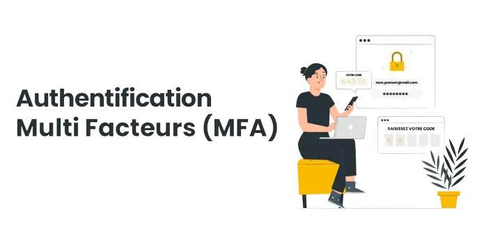
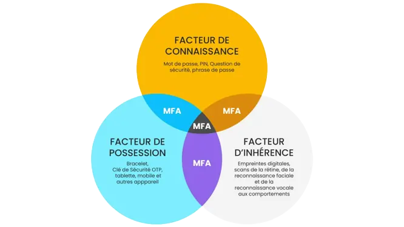

# :closed_lock_with_key: L'authentification multifacteurs

==- :wrench: Révisions

Auteur | Date | Changes
--- | --- | ---
contactit.fr | 30/08/2023 | Initial push

===

:information_source: La multifactor authentication (MFA), en français : authentification à plusieurs facteurs ou A2F/2FA (Authentification à 2 facteurs), est une méthode de sécurité informatique qui exige que l'utilisateur fournisse au moins deux types d'informations distincts pour vérifier son identité. Ces facteurs se répartissent généralement en trois catégories :  

- **Quelque chose que vous savez** : Il s'agit généralement d'un mot de passe ou d'un code PIN.  

- **Quelque chose que vous avez** : Un appareil physique, comme un téléphone ou une clé de sécurité (ex: <a href="https://www.yubico.com/la-cle-yubikey/?lang=fr" target="_blank">yubikey</a> ), qui génère un code unique ou reçoit un message d'authentification.  

- **Quelque chose que vous êtes** : Caractéristiques biométriques, comme les empreintes digitales, la reconnaissance faciale ou l'analyse de l'iris.  

:arrow_right: Même si un facteur est compromis, un attaquant aurait encore besoin de l'accès à d'autres facteurs pour réussir à s'authentifier. Cela réduit les risques liés aux attaques par force brute et aux tentatives de phishing, renforçant ainsi la protection des comptes.  