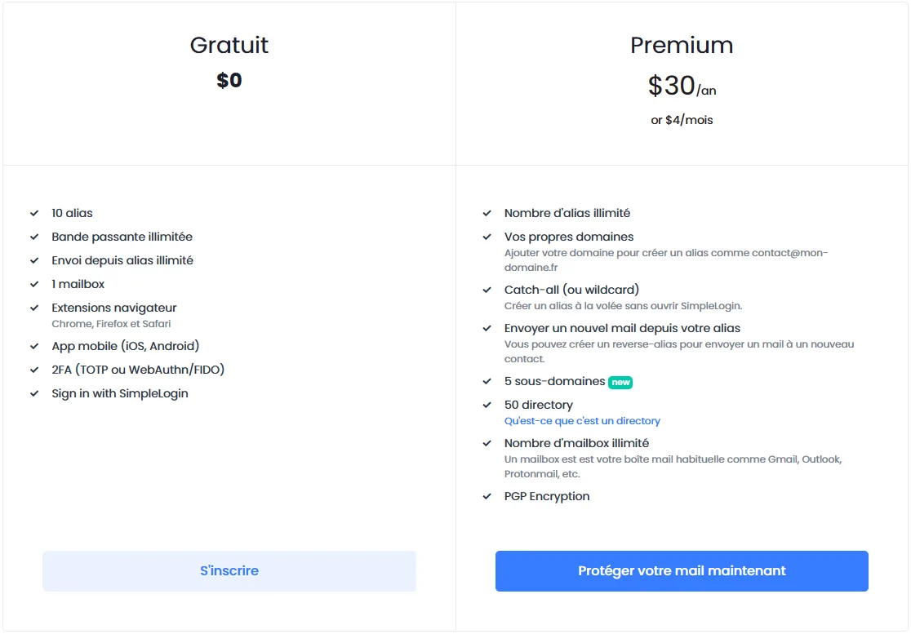
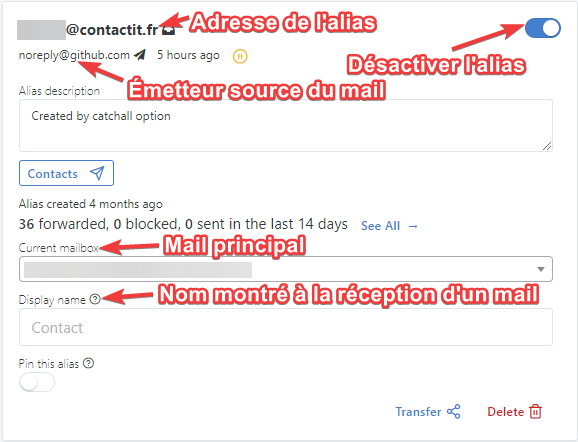

# :incoming_envelope: Alias mail, recevoir et envoyer des mails anonymement

==- :wrench: Révisions

Auteur | Date
--- | ---
contactit.fr | Initial push

===

!!!danger
Les alias mails avec les '+' ne seront pas traités dans cet article, beaucoup de sites bloquent l'usage des caractères spéciaux dans l'adresse mail et quand bien même ajouter un plus à l'adresse, celle-ci reste visible.
!!!

:information_source: Un alias mail fonctionne de manière similaire au transfert de mails. Un intermédiaire se charge de recevoir le mail et de le tranférer au destinataire.  

:arrow_right: Ici, c'est donc un service intermédiaire qui va se charger de faire ces tâches de manière transparente. Pour citer les 2 services d'alias mail les plus connus : [SimpleLogin (by Proton)](https://simplelogin.io) et [Addy (précédemment AnonAddy)](https://addy.io) . Ces services proposent d'ailleurs 15 adresses (alias) mails pour leurs plans gratuits respectifs. Comme vous l'avez compris, ce n'est plus votre principale que vous allez donner à un service, une personne... mais plutôt une adresses générée par le biai du service en question.  

---

## :white_check_mark: Les avantages

- Dans le cas d'un leak d'un service, le mail principal ne fuite pas.
- Vous gardez votre mail principal, mais vous avez des dizaines d'adresses facilement manageable.    
- Possibilité de désactiver ou supprimer une adresse en cas de spam.  
- Prise en charge de la fonctionnalité catch-all pour votre domaine.  
- Possibilité de transférer les mails reçus d'un alias mail, vers plusieurs adresses mails automatiquement (liste de diffusion).  
- Génération des alias facilitée avec l'extension.  
- Intégration et génération des mails incluent dans ProtonPass (SimpleLogin).

---

## :x: Les inconvénients 

- Dépendance au service pour les mails utilisés.  
- Confiance du service dans le transport des mails.  
- Limite de mails, bande passante et quotas limités pour les envois/réceptions (Addy.io).  
- Limite de taille des pièces jointes à 25 Mo (Si vous dépassez cette taille de fichier utilisez un service de partage de fichiers comme [SwissTransfer](https://www.swisstransfer.com/))  

==- :icon-shield-x: Est-ce que les adresses mails continuent de fonctionner après la fin de mon abonnement ? 

SimpleLogin continue à vous proposer ses services même après la fin de votre abonnement :  

"When your subscription ends, all aliases you created continue working normally, both on receiving and sending emails. Concretely:
- All aliases/domains/directories/mailboxes you have created are kept and continue working normally.
- You cannot create new aliases if you exceed the free plan limit, i.e. have more than 10 aliases.
- As features like catch-all or directory allow you to create aliases on-the-fly, those aliases cannot be automatically created if you have more than 10 aliases.
- You cannot add new domain, directory or mailbox.  

For example, if you have 100 aliases by the time your subscription ends, these 100 aliases will continue receiving and sending emails normally. You cannot however create new aliases."  

===

---

## :dollar: Les prix et fonctionnalités 

SimpleLogin | Addy
:---: | :---:
 | 

:arrow_right: Je recommande SimpleLogin qui présente le plus de fonctionnalités par rapport à ses concurrents. De plus, le service a été racheté par Proton et est gratuit (avec premium) pour les abonnés.

---