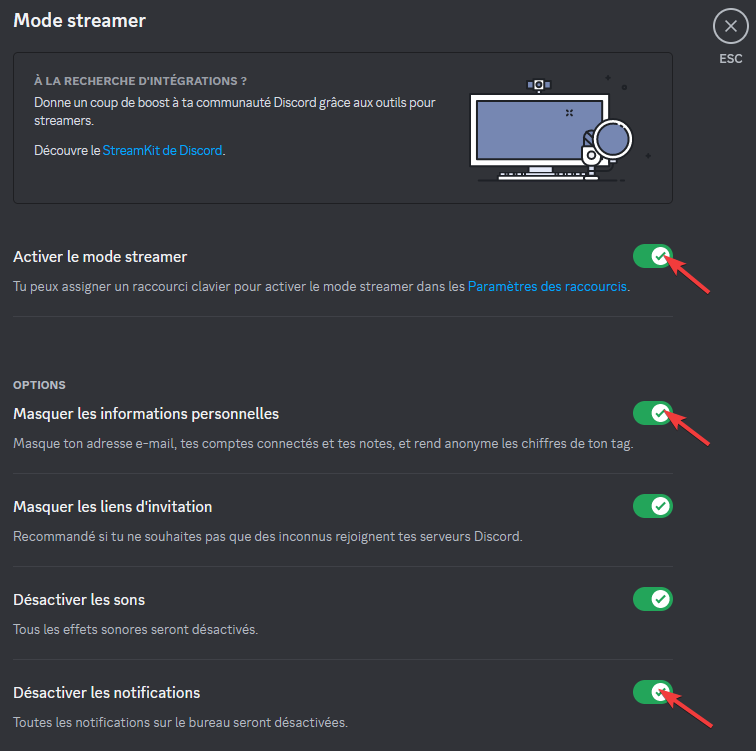
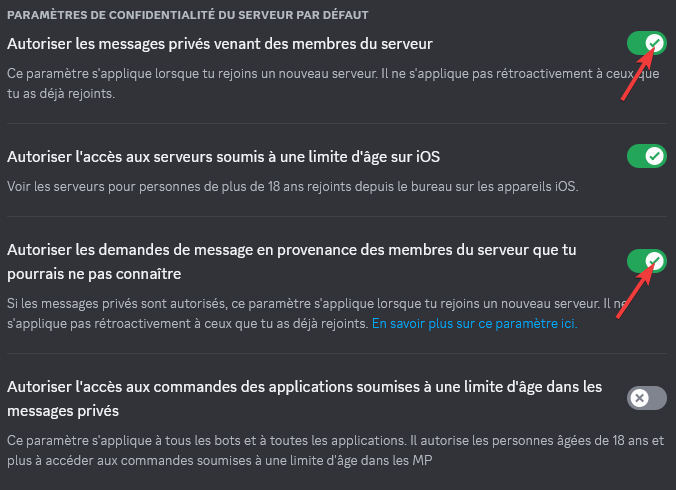

# Limiter sa surface d'attaque sur Discord

:icon-info: Avez-vous déjà entendu parler de **"DOX/DOXXING/SWAT"**, si oui vous êtes au bon endroit pour **comprendre le fonctionnement de ces pratiques et vous en protéger !** 

➡️ Le fait de "DOX" est de **partager des informations personnelles** sur une personne **sans son consentement**, dans le but de nuire.

:icon-tools: Le principe technique qui se cache derrière ce terme est l'**OSINT**. L'**Open Source Intelligence** est une pratique de **reconnaissance légale** visant à **récolter des informations sur une entité physique ou morale** à partir de **sources ouvertes**. Elle est utilisée par les professionnels de la cybersécurité, les agences gouvernementales, les autorités... Comme vous l'avez compris ce n'est pas une niche mais une pratique qui peut être très puissante.  

:icon-milestone: Les sources utilisées en OSINT sont nombreuses :  

- Les sites/applications et réseaux sociaux (vos **comptes** sur ces derniers) et donc par extension, le contenu que vous partagez sur ceux-ci.
- Les bases de données leaks (services/sites compromis dont des informations ont fuité en ligne).
- Les pages blanches/jaunes.
- Les sites et outils spécialisés (Mr.Holmes, Maigret, Holehe...).

:icon-shield-check: Comme vous l'avez compris l'OSINT est un **processus d'investigation** à la base **PASSIF** ( ont exclu ici le phishing ou "token grab").  

Cet article vise à donner des éléments pour **prévenir la récolte d'informations** et **maîtriser l'exposition de votre profil Discord**.  

✅ Pour faire court, le gros du travail peut être fais en utilisant une fausse identité et en partageant le minimum d'informations possibles.

➡️ Il existe différent points d'entrée :  

- Le pseudo.
- La biographie.
- La photo de profil.
- Les comptes liés (réseaux sociaux, Spotify, jeux...).
- L'ID utilisateur (accessible depuis les developer tools) . 

!!!info
La date de création du compte ainsi que la date à laquelle vous avez rejoint un serveur, donnent des informations sur la récence de votre compte, donc par extension des informations vous concernant.
!!!

:icon-thumbsup: **Le bon sens est tout aussi important** :

- Ne partagez pas d'information (oral, écrit, partage d'écran et webcam) à caractère personnel sur Discord.  
⚠️ **À PERSONNE** (ni amis, ni "connaissances", ni même à votre famille ou collègues) !!!

---

## ℹ️ ZONE 1 (facile)

!!!success
Cette zone est destinée aux néophytes qui souhaiteraient mettre en place le minimum vital rapidement.
!!!

==- ↘️ Déplier la zone

- Ne pas utiliser le même pseudo sur toutes vos plateformes, privilégiez un pseudo unique à Discord.
- Limitez-vous au strict nécessaire dans votre biographie, pas de [Linktr.ee](https://linktr.ee/) ou de liens vers vos réseaux sociaux.
- Évitez les tokens grab, cookie stealer ou iplogger : **ne cliquez sur AUCIN LIEN dans Discord**, ouvrez-le dans un autre navigateur (si possible prévu à cet effet (sandbox ou [service en ligne](https://www.browserling.com/))). 
- Ne liez pas vos comptes de jeux et sites à Discord ! Si vous devez lier un ou plusieurs comptes, décochez l'affichage sur votre profil :  

- N'utilisez aucun selfbot, injection client (betterdiscord like) ou tout autre modifications du client.

===

---

## ⚠️ ZONE 2 (intermédiaire)

!!!warning
Cette zone s'aditionne à la précédente et **inclut différents changements de paramétrages** dans Discord.
!!!

==- ↘️ Déplier la zone

- Si vous partagez votre écran, activez le mode streameur :

- S'assurer que **"Filtrer tous les messages privés"** (spam) soit activé :

- S'assurer qu'**"Autoriser les messages privés venant des membres du serveur"** et **"Autoriser les demandes de messages en provenance des membres du serveur que tu pourrais ne pas connaître"** soient désactivés :

===

---

## 🔐 ZONE 3 (avancé)

!!!danger
Cette zone s'additionne aux précédentes et présente des **concepts avancés** pour limiter la surface d'exposition de votre compte Discord.
!!!

==- ↘️ Déplier la zone

- Recréez un compte avec une fausse identité (https://www.fakenamegenerator.com pallie le potentiel risque de leaks de l'ancien compte).
- Utilisez un **email unique** pour Discord (alias recommandés ex. [simplelogin](https://simplelogin.io/)).
- Utilisez un mot de passe respectant [!button corners="pill" size="s" target="blank" text="Les éxigences de l'ANSSI :icon-link-external:"](https://www.ssi.gouv.fr/guide/recommandations-relatives-a-lauthentification-multifacteur-et-aux-mots-de-passe/) (complexité, stockage et cycles de vie, gestionnaire de mot de passe fortement recommandé (ex. [KeePass](https://keepassxc.org)) et activez **l'authentification multifacteurs**.
- Pour la 2FA utilisez un **numéro de téléphone unique à Discord** (ex. [onoff](https://www.onoff.app)).

===

