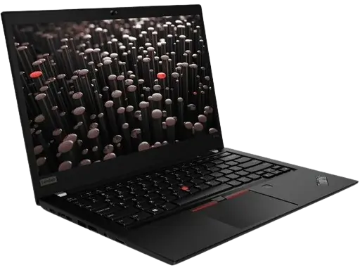
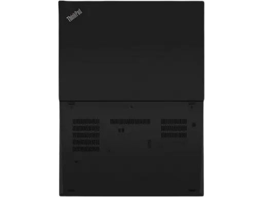
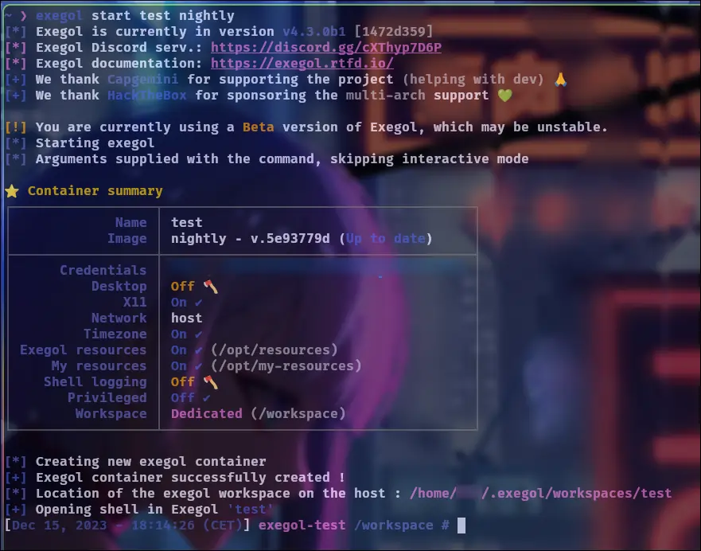
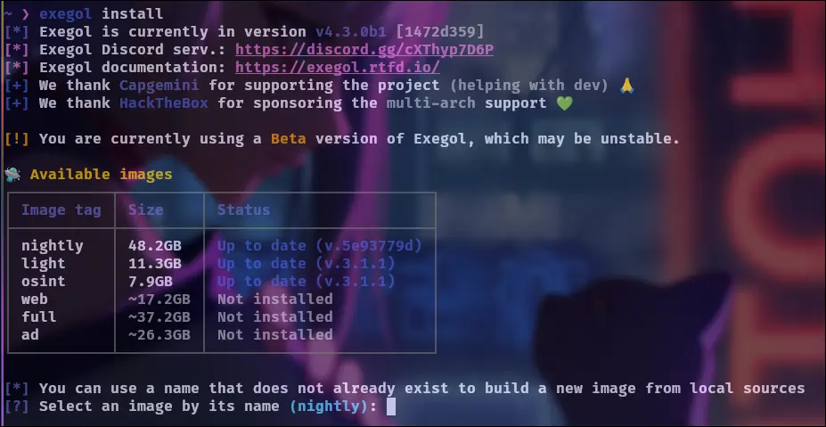
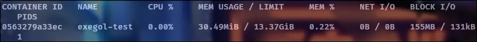
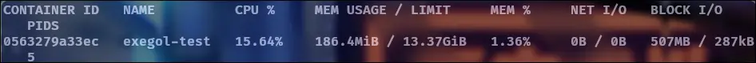
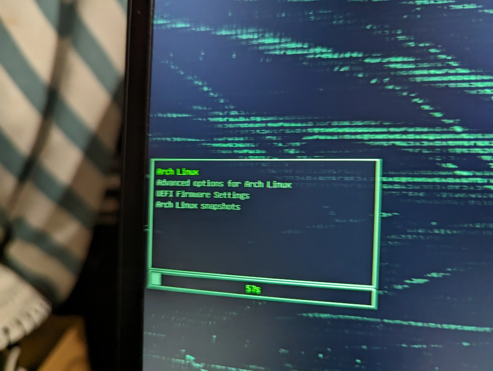
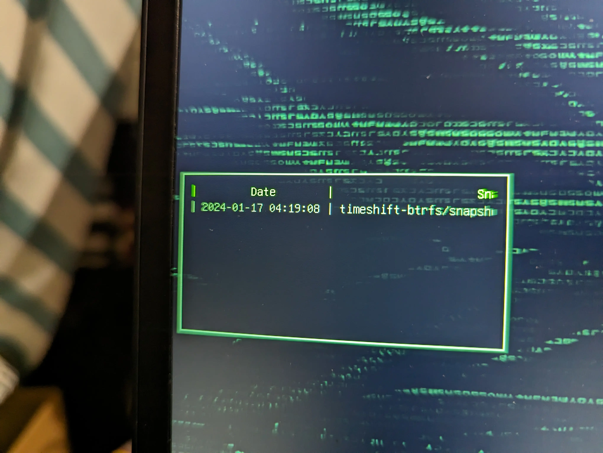

# 💻 My workstation configuration

---

# 🔬 Which model you choosed ?

Before naming the model, I would like to say first that I set some limits regarding the budget and the performance of the machine. I need laptop for the **school and events** and I want it to be as **powerful as possible** (I tought about an i7 or Ryzen 7 and 16GB, seems good for few virtual machines and pentesting) for a budget around **$600** (550€). So, I looked for a **second hand computer** on famous marketplaces in order to get a good bang for the buck. Ideally I would like a **fingerprint sensor**, a **"cache camera"** included and a **lightweight** one (for moving).

As an IT worker for few years now, I noticed that a lot of enterprises (including the ones I was in) **switched from various brands to Lenovo Thinkpads** for good reasons as look, feel, performance/price, keyboard, functionalities and most of all stability and good support. I had many Thinkpads in hands and feel great. I will take one personnally.

The context is said, after few weeks of search I found one feets my needs in a perfect condition for $550. The storage was about **500GB**, so I commanded a new nvme of **1TB** at the same time for $100.

Here is the precise model i have now : **Lenovo ThinkPad P14s Gen 1 - 14"**

+++ Front

+++ Behind

+++

CPU | RAM | ROM
--- | --- | ---
Ryzen 7 PRO 4750U (8 physicals cores) | 16GB 3200Mhz | 1TB Nvme Samsung EVO 775 Pro

All specifications could be found [here](https://www.officexpress.fr/10145925-20y1000qfr-lenovo-thinkpad-p14s-gen-20y1-amd-ryzen-pro-4750u-jusqu-ghz-win-pro-bits-radeon-graphics-ram-256-ssd-tcg-opal-encryption-ips-1920-1080-full-noir-clavier-fran-ais-3540260184357).

**PS** : I thinked about thinkpad with **IntelME** __partially__ disabled and **libreboot** 🕵️, but minifree.org don't provide recent machines, I was interested by the T440p they have (literaly a brick) and there is a significant gap betwteen the i7 4th gen in and the Ryzen 7 4th gen of the P14S Gen1.

---

### ⚙️ What Operation System do you use ?

-

**So yeah, I use Arch btw.........** 😎

If you want to take care about packages, configurations and scripts yourself Arch is the way to go to keep control and mostly **LEARN** by doing and understand the way packages and GNU/Linux works. Since the OS is really minimal per default so **"DO IT YOURSELF"**.

ArchLinux is a **"Rolling release"** distribution means that packages are upgraded on latest version when available, so there are no "releases". There is the "Arch Wiki" as well, who you can compare to the "Holy bible" of arch users (and yeah, it's pretty HUGE). The **"Arch user"** is **THE** smart guy (That what the users said not me 😀, lots of humor).

The **"Arch Users Repository"** is a huge repository of packages provided by the community, it aims at complete the officials ones and permit to all developers to share their packages. Keep in mind that theses packages are unofficial.

---

### 📟 What about your desktop environment ?

-

:icon-paintbrush: I love simple, modern and smart things. I discovered **Hyprland** few years ago and decided to give it a try on this laptop, so I searched at tutorials on youtube to see how peoples managed to install, customize it and the results. I land on the **Ja Kool.it**'s [youtube channel](https://www.youtube.com/@Ja.KooLit) and followed the "My Hyprland Dots v2 on Debian 13 Linux minimal using netinstaller and Debian-Hyprland install script" [video](https://www.youtube.com/watch?v=Qc4VP9JFh2Y). This config **blew my mind**, it worked out of the box, it was fast, responsive and eyes candy!

:icon-ruby: But wait, you said you're on Arch right now ! So yes, I switched few weeks later because of the **unsustainability of the SID realease of debian**, the fact that some **core packages aren't maintained** and Ja would like to **stop the support about his configurations on debian Trixie** for the moment. 

:icon-pencil: **EDIT**: I switched to the [ML4W's dotfiles](https://gitlab.com/stephan-raabe/dotfiles), more updated, GUI to modify hyprland settings and better integrations.

---

### 🛠️ What about pentesting tools ?

When you want a **pentesting environment**, you will think first about a GNU/Linux "Hacking" distribution like : Kali, Parrot, BlackArch or AthenaOS. The huge downside of theses distributions is you **don't have the the control about the installed packages, the python projects implementation** (are they installed properly in venv, with symlinks for convenience ?), **the bloatwares** (packages installed by default that you will never use and yeah, there are a lots !), oh, and yes again **python dependancies that can get conflicts with the time**. To conclude, separate the operation system from the tools used is the way to go.  

Its here that **exegol** enter. For thoses who aren't familiar with exegol, it's a French FOSS project made by Shutdown, Dramelac with the support of capgemini (A big tech company) and Hack The Box mainly. The goal is to **keep the OS clean by managing containers with a docker backend**. A python wrapper take care of all the "docker things" for you. So, in a container you have : **all tools you need**, you can attach a **vpn** to it (--vpn config.ovpn), open a browser and apps with a GUI, attach **usb devices**, **remote desktop into the container environment** (in beta, with --desktop) and more (For all features look at [The Exegol Docs](https://exegol.readthedocs.io/en/latest/)).

The whole thing made easy as starting a container :

```sh
exegol start test nightly
```



Where `test` is the container's name and `nightly` the docker image it's based on. You can download exegol images easily with :

```sh
exegol install
```

It will ask your for the name of the image you want to install as the table shows.



The following tests are run within a container based on the nightly image :

Idle consumption | Rustscan with -- -A parameter
:---: | :---:
 | 

You can follow installation steps and get some tips here:  

[!ref icon="note"](cybersecurite/Pentest/Exegol_Cheat_Sheet.md)

---

#### 🔧 Important Notice

**Note**: When Arch was installed i experienced issue about the keybloard layout into the cryptsetup prompt (which was set to US). It seems to be an old issue for a lots of Arch users, here is the solution (in chroot after installation or enter your passphrase and think about QWERTY layout):

```sh
vim /etc/vconsole.conf
```

It seems to be an issue with the definition of the **KEYMAP** variable in `fr`, so need to switch to `fr-latin9` and rebuild the linux image:  

```sh
KEYMAP=fr-latin9
```

And then rebuild the image (need root privileges):

```sh
mkinitcpio -P
```

## 📷 Webcam fix

The integrated webcam didn't work, i needed to install the missing firmware :

```sh
yay -S upd72020x-fw 
```

### 📒 IDE

I use vscode and `nvchad` (based on neovim) as well to navigate and edit file easily in directories :

```sh $
nvim
```


---

### 🗄️ And for Virtualization ?

I use QEMU/KVM and a script to launch and RDP automatically a forensics Virtual Machine

**QEMU imstall:** Make sure you update your system with a `sudo pacman -Syu` BEFORE you install the dependencies:

```sh
sudo pacman -S qemu virt-manager virt-viewer dnsmasq vde2 bridge-utils openbsd-netcat ebtables iptables libguestfs
```

Edit /etc/libvirt/libvirtd.conf (Change the following Lines):

```sh
unix_sock_group = "libvirt"
unix_sock_rw_perms = "0770"
```

Then add your user and create group:

```sh
sudo usermod -a -G libvirt $(whoami)
```

```sh
newgrp libvirt
```

Source: [](https://christitus.com/setup-qemu-in-archlinux)

And the **Remote Desktop script**:

```sh
#!/bin/bash

# Thanks to Stephan Raabe for the script

if [ -f ~/private/win11-credentials.sh ]; then
	echo "Credential file exists. Using the file."
	source ~/private/win11-credentials.sh
else
	win11user="USER"
	win11pass="PASS"
	win11ip="IP"
	win11name="windows11"

	echo "## Preparing to remotely access your Windows virtual machine ##"

	echo -n "Please enter your virtual machine name [default: $win11name]: "
	read vmname
	vmname=${vmname:-$win11name}

	echo -n "Please enter your virtual machine ip [default: $win11ip]: "
	read vmip
	vmip=${vmip:-$win11ip}

	echo -n "Please enter your username [default: $win11user]: "
	read user
	user=${user:-$win11user}

	echo -n "Please enter your password [default: $win11pass]: "
	read password
	password=${password:-$win11pass}
fi

# echo "Hello, $vmname, $vmip, $user, $password"

tmp=$(virsh --connect qemu:///system list | grep " $vmname " | awk '{ print $3}')

if ([ "x$tmp" == "x" ] || [ "x$tmp" != "xrunning" ]); then
	echo "Virtual Machine $vmname is starting now... Waiting 30s before starting xfreerdp."
	notify-send "Virtual Machine $vmname 11 is starting now..." "Waiting 30s before starting xfreerdp."
	virsh --connect qemu:///system start $vmname
	sleep 30
else
	notify-send "Virtual Machine $vmname is already running." "Launching xfreerdp now!"
	echo "Starting xfreerdp now..."
fi

if command -v xfreerdp >/dev/null 2>&1; then
	xfreerdp -grab-keyboard /v:$vmip /size:100% /cert-ignore /u:$user /p:$password /d: /dynamic-resolution /gfx-h264:avc444 +gfx-progressive /f &
elif command -v xfreerdp3 >/dev/null 2>&1; then
	xfreerdp3 -v:$vmip -u:$user -p:$password -d: -dynamic-resolution /cert:ignore /f /gfx:AVC444 &
else
	echo "'xfreerdp' or 'xfreerdp3' command not found."
fi
```

---

### 🗃️ How do you manage programs ?

**Pacman** take care of core/extra packages, **yay** of **AUR**'s ones.  

---

## ☕ Auto snapshots configuration

It is advisable to establish a "disaster recovery plan" for the operating system during the initial setup. Upgrades may sometimes conflict with each other or disrupt system packages, leading to potential boot/login issues. So I employed timeshift to create daily snapshots, retaining the last three days worth. Additionally, I have incorporated the timeshift-autosnap AUR package to automatically generate a timeshift snapshot when upgrades are initiated through pacman hooks.  

Subsequently, I configured Grub to make these snapshots accessible, allowing for a direct boot into them. I Followed this [tutorial](https://discovery.endeavouros.com/encrypted-installation/btrfs-with-timeshift-snapshots-on-the-grub-menu/2022/02/).

Grub boot menu | Snapshots list
:---: | :---:
 | 

---